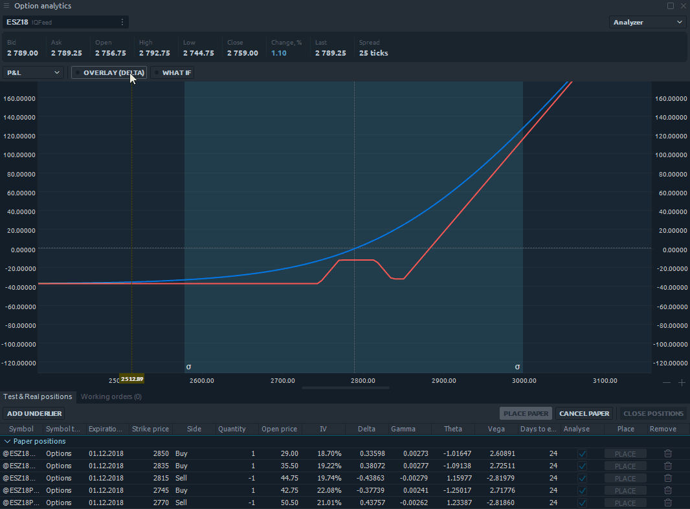

# Option Analytics

Option Analytics is a professional panel for options traders that allows making strong options analysis and send orders in one click.

There are 3 main controls on the main toolbar

**Symbol Lookup** for selecting a trading instrument that has an option series

* **Level 1 bar** provides information about current Ask/Bid/Last prices, spread and day range of selected symbol
* **Panel Appearance** allows trader to go throungt three different views of panel: _**Option desk, Analyzer**_ and combination of _**Desk & Analyzer**_ simultaneously.

## **Options desk** 

(1) - This control allows to manage simultaneously visible options series and strikes. (2) - Right click on table's header will show a context menu where trader can select visible columns. (3) - Paper column is an interactive column that used to add a paper position to porfolio, to do it - click on column's cell and set value. (4) - Right click on a row will show a strike's context menu

(5) - Double click on Ask/Bid cells will open an Order Entry panel

## **Joint mode of Option Desk & Analyzer** 

Add Paper positions in the options desk and the strategy analyzer will immediately show the option profile. This mode will allow you to see all changes in options desk — prices, volatility, options Greek values — and option profiles on one screen.

Option Analytics panel offers the joint mode of Options Desk and Analyzer

## **Analyzer** 

Analyzer allows users to see the profile of existing portfolio. The profile illustrates a behavior of portfolio in cases of underlying instrument price change, volatility change or time decay. Also Analyzer provides a possibility to add an overlay to main chart. It can be one of Greeks: Delta, Gamma, Vega, Theta or Rho

.png>)

(1) - This controll allows to select a chart's data type. Possible options are: P/L, Delta, Gamma, Theta, Vega, Rho (2) - This controll allows to add an overlay to main chart

(3) - By clicking on this button user can apply "What if" scenarios.

Trader is able to simulate the time decay and volatility impact scenarios simultaneously or separately by setting corresponding values. Up to 5 lines can be drawn at the same moment of time. All "What if" lines are drawn in dashed style.

## **Papers, Positions, Working orders** 

The bottom part of the panel contains combined table with paper positions, real positions and working orders

 (6).png>)

&#x20;(1) - Add underlier button allows to add a paper position of underlying symbol to the list of existing positions. (2) - Hot buttons provide a possibility to make group actions with portfolio such as: place papers, cancel papers or close real existing positions. (3) - Right click on table's header will show a context menu where trader can select visible columns. (4) - By clicking on Anayse checkboxes user can include or exclude certain positions from portfolio. (5) - Place button allows to place a paper position (6) - Remove icon allows to remove a paper position
