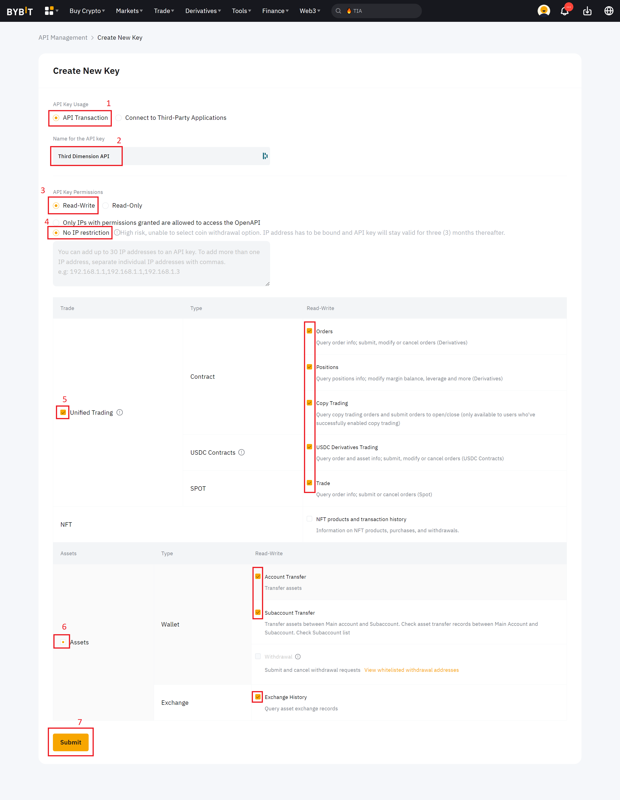
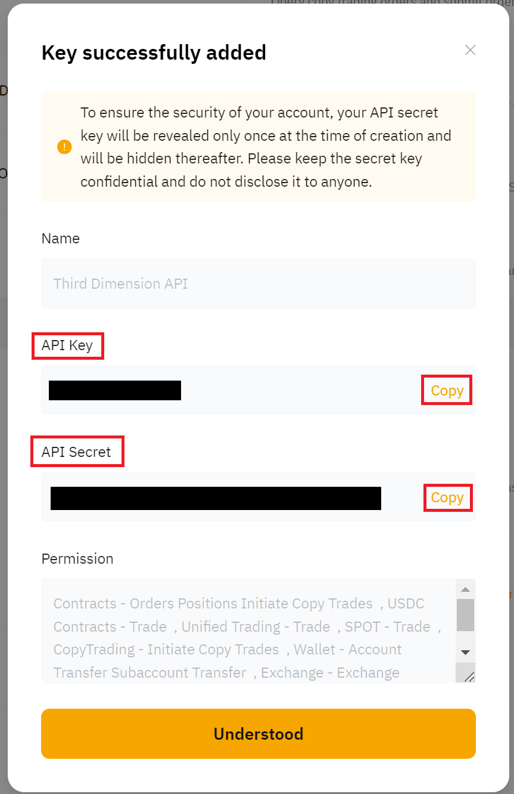
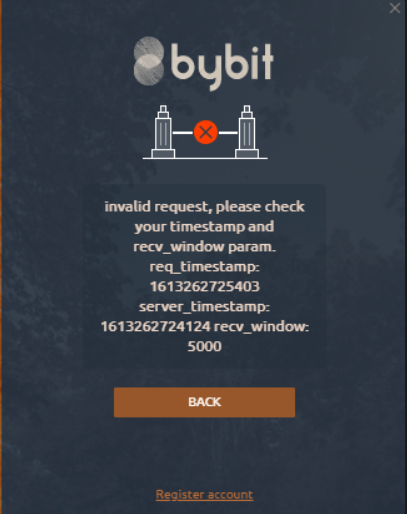
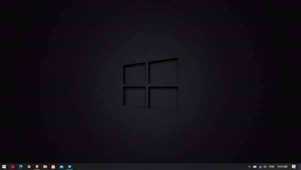
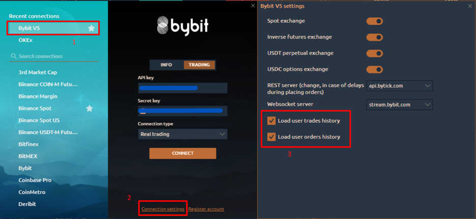
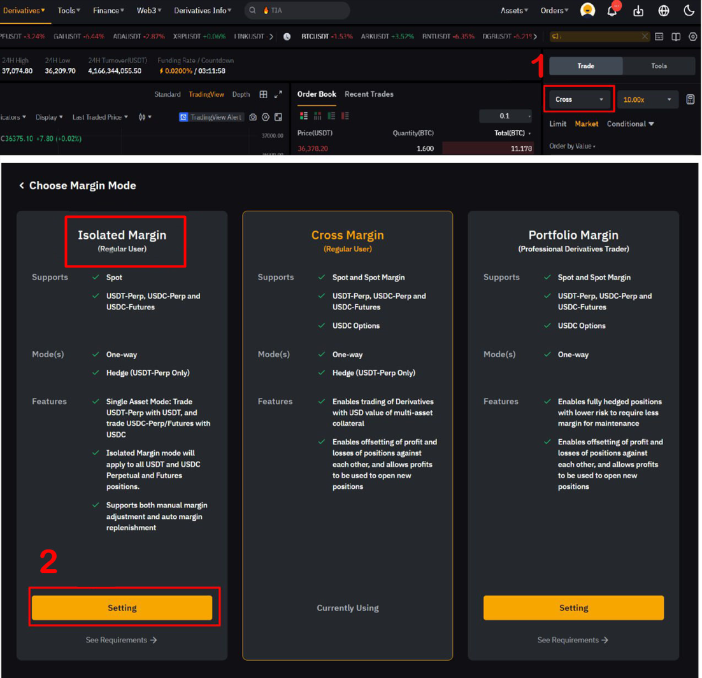

# Connection to Bybit

In this guide, we will cover all the steps required to create a trading account on Bybit and connect to the 3rd Dimension platform.

·        [Open an account on Bybit to get personal API keys.](connection-to-bybit.md#open-an-account-on-bybit-to-get-personal-api-keys)

·        [Upgrading Bybit account to unified.](connection-to-bybit.md#upgrading-bybit-account-to-unified)

·        [Possible Errors with Bybit connection.](connection-to-bybit.md#possible-errors-with-bybit-connection)

Note, that in the platform, you can connect to the exchange in two modes:

Info Mode — free and quick way to view charts and other data for cryptocurrencies on the Bybit exchange without the need to enter keys

Trading Mode — for trading on the Bybit exchange in demo or real mode. API Keys are required. Below you will show how to get keys for trading.

<figure><figcaption></figcaption></figure>

## Open an account on Bybit to get personal API keys


* For REAL Trading please create an account on Bybit.com [https://partner.bybit.com/b/62129](https://partner.bybit.com/b/62129)
* For DEMO Trading please create an account on Testnet.Bybit.com[ https://testnet.bybit.com/](https://testnet.bybit.com/)


Go to the[ Bybit official website using this link](https://partner.bybit.com/b/62129) and go through the procedure for registering a new account on the exchange.

For email registration, please enter your email, preferred password and (!) referral code 62129 Swipe the verification page then enter the verification code sent to your email inbox.

<figure><figcaption></figcaption></figure>

To create/manage your Bybit API keys, please click onto the top right on your username. Inside the dropdown menu, click on 'API'.

<figure><figcaption></figcaption></figure>

Click on 'Create New Key' located on the right side of the 'API Management' page

<figure><figcaption></figcaption></figure>


You need to configure two-factor authorization on Bybit. It is necessary for creating keys.


Select your API key type

<figure><figcaption></figcaption></figure>

The following pop-out window will appear. Please configure your API key according to your trading needs.

<figure><figcaption></figcaption></figure>

After entering all the required information, a window will appear to inform us that the API successfully added.

<figure><figcaption></figcaption></figure>

## Upgrading Bybit account to unified:

upgrading your Bybit account to unified trading Helps to reduce problems with 3rd dimension bots, to upgrade your account to unified first make sure to close any opened positions, cancel any placed orders, and then follow the steps below:

1. Upgrade the main account to a unified account:

<figure><figcaption></figcaption></figure>

2. Upgrade your API to UTA Pro:

<figure><figcaption></figcaption></figure>

## Possible Errors with Bybit connection

·        **"Timestamp error"** means that your local time on PC is not the same as on Bybit servers and it should be synchronized.

<figure><figcaption></figcaption></figure>

**·**        To solve it, please, go to **Windows Settings > Time & Language >** and click on **Sync Now** butto&#x6E;**.**

<figure><figcaption></figcaption></figure>

Or you can right-click on the clock in the corner of the screen, then choose adjust date and time, then Sync now

<figure><figcaption></figcaption></figure>

• Refuse (bybit)- you don't have enough funds - fund your account

<figure><figcaption></figcaption></figure>

• To fix TPA errors after reconnection, update Bybit connection settings as the following:

<figure><figcaption></figcaption></figure>

* &#x20;If your Bybit connection is unstable(It keeps disconnecting and reconnecting), try changing the WebSocket server from the connection settings, this may help to reduce the issue :

<figure><figcaption></figcaption></figure>

* unified account margin mode adjustment \
  when trading futures using Third Dimension trading bots, it's recommended to adjust the account margin mode to "Isolated" for better risk management and to avoid unexpected behavior.

<figure><figcaption></figcaption></figure>
