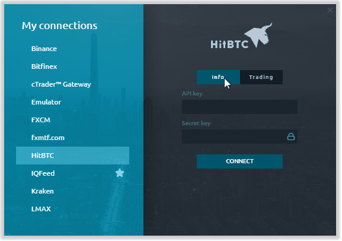

# Connection to HitBTC

## Added trading on HitBTC, default settings for drawings & indicators and more customizations

One of the important elements of our platform development is feedback from users. That's why we have entirely dedicated this update not only to bug fixes and optimizations but also took into account requests from our users.

### Added Trading on HitBTC 

In the previous version, we made a [connection to the HitBTC crypto exchange](http://thirddimension.exchange/index.php/blog) as a market data provider. Today we are pleased to announce that we have added the ability to trade on HitBTC using the 3rd dimension platform. Just enter your trading account data — **API Key** & **Secret Key** — and trade cryptocurrencies on a modern trading platform.

