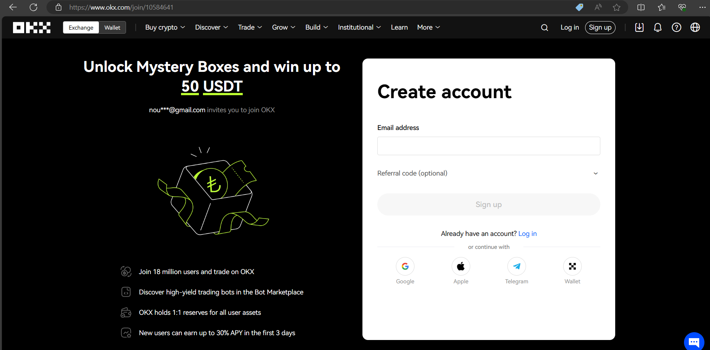
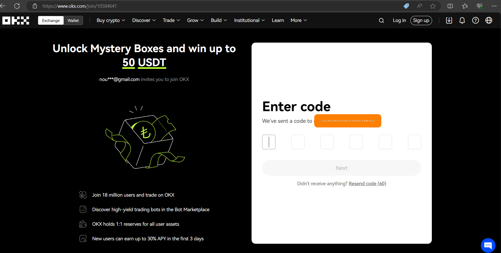
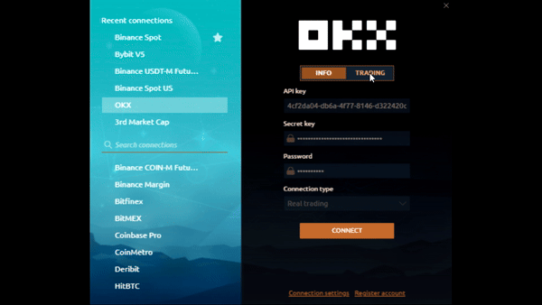
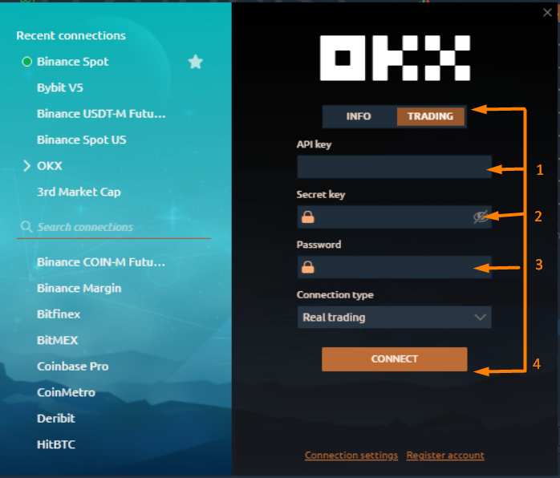

# Connection to OKX

In this guide, we will cover all the steps required to create a trading account on OKX and connect to the 3rd Dimension platform.

1- [How to Create an account on OKX exchange](connection-to-okx.md#how-to-create-an-account-on-okx-exchange)\
2- [How to Create an API ](connection-to-okx.md#how-to-create-an-api)\
3- [How to connect to 3rd Dimension ](connection-to-okx.md#how-to-connect-to-3rd-dimension)

## How to Create an account on OKX exchange

Go to the [OKX ](https://okx.com/join/10584641)homepage and click on the [**Sign up**](https://okx.com/join/10584641) button located at the top right corner .

<figure><figcaption>
OKX Home Page
</figcaption></figure>

Enter your email address in the **Email** field and click on the **Sign up**.

<figure><figcaption></figcaption></figure>

* Check your email for the six-digit registration verification code that OKX sent you and enter it in the **Enter code** field within 10 .

<figure><figcaption></figcaption></figure>

* Enter the password you want to use for your account in the **Password** field and click on the **Next** button.

<figure><figcaption></figcaption></figure>

* You can now access your OKX account dashboard and choose to buy crypto with a card or deposit crypto from another platform or wallet.

<figure><figcaption></figcaption></figure>

That’s it! You have successfully created an account on OKX exchange.&#x20;

## How to Create an API

To generate an API key, please follow these steps:

1. Click **Manage** on the right of the project you wish to create an API key from.

<figure><figcaption></figcaption></figure>

2. Click **Create API key**.

<figure><figcaption></figcaption></figure>

3. Enter your **API key name** and **passphrase** for your new API key. Click **Create** to generate your API key.

<figure><figcaption></figcaption></figure>


The passphrase will be needed to access the APIs. If the passphrase is lost, you will be unable to access the API key. Please write down and remember your passphrase.


Congrats! You have created an API key.

<figure><figcaption></figcaption></figure>

## How to connect to 3rd Dimension&#x20;

Note, that in the platform, you can connect to the exchange in two modes:

Info Mode — free and quick way to view charts and other data for cryptocurrencies on the OKX exchange without the need to enter keys

<figure><figcaption></figcaption></figure>

Trading Mode — for trading on the OKX exchange in demo or real mode. API Keys are required. Below you will show how to get keys for trading.

<figure><figcaption></figcaption></figure>

1- In this section we put the API key that we create before.\
2- In this section we put the security key .\
3- In this section we put the passphrase that we created it when we created the API.\
4- click connect to connect the API .

<figure><figcaption></figcaption></figure>
