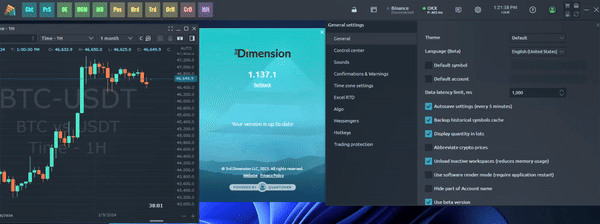
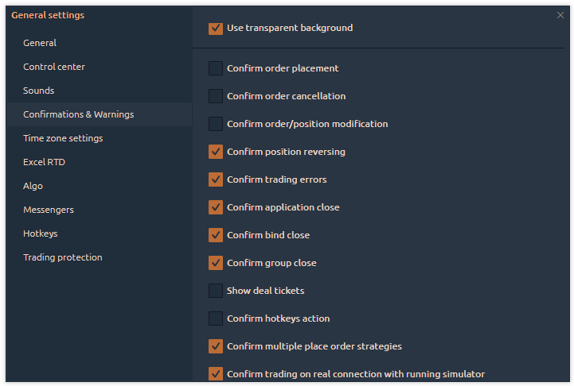
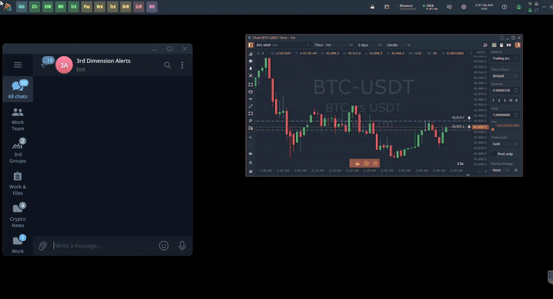
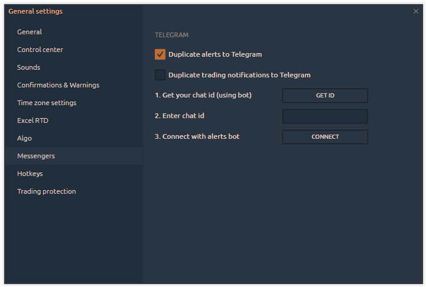
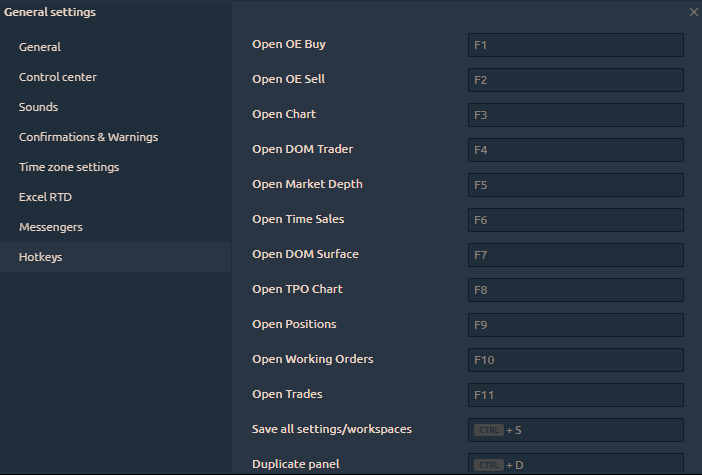

# General settings

Click on the **Gear icon** on the [main toolbar](3rd-dimension-main-toolbar.md) to open General Settings.

<figure><figcaption>
General Settings are placed on the platform's main toolbar (Gear Icon)
</figcaption></figure>

It is logically grouped into several tabs:&#x20;

* [**General**](general-settings.md#general-settings-tab)
* [**Control Center**](general-settings.md#control-center)
* [**Sounds**](general-settings.md#sounds)
* [**Confirmations & Warnings**](general-settings.md#confirmations)
* [**Time zone settings**](general-settings.md#time-zones)
* [**Excel RTD**](general-settings.md#excel-rtd)
* [**Messengers**](general-settings.md#messengers)
* [**Hotkeys**](general-settings.md#global-hotkeys)
* [**Trading protection**](general-settings.md#trading-protection)


Most changes are applied automatically, but complex settings require confirmation for proper implementation.


## General settings tab

<figure><figcaption>
General settings of 3rd Dimension— Localization, Themes, Sounds, RTD, Time zones
</figcaption></figure>

**Theme** — Сhoose one of the 8 color schemes that suit you best

* Default Blue theme
* Dark Autumn
* Dark Forest
* Dark Gold
* Grayscale
* Light Forest
* Light Gold
* Light Water

<figure><figcaption>
Coloring themes in 3rd Dimension
</figcaption></figure>

**Language (beta)** — 3rd Dimension supports 17 languages. In case of errors or inaccuracies in translation, any user can make changes to the text. Read the manual on how to make changes in the selected language.

**Default symbol** — set up a default trading symbol that will open in all trading panels automatically.

**Default account** — specify the trading account that should be set as the default option in all trading panels.

**Data latency limit, ms** — set a threshold value, and when it's reached, a message about market data delays will be displayed in the trading panels. For example, if you set a 100 ms limit, you will see the message on the chart.

This message appears when there's a delay in data within a specific time interval. The cause may stem from a <mark style="color:red;">**slow Internet connection**</mark> or <mark style="color:red;">**issues on the data provider's end**</mark>.

Whether the data delay occurs on a Bybit server, Kucoin, OKX, Binance, or during transmission to the client, we make efforts to identify instances where server-side timestamps start to lag.

Additionally, you have the option to mitigate data load by closing panels, disabling volume tools, or closing unnecessary tabs in your browser (if it's active while using the platform).

<figure><figcaption>
Data latency on a chart panel
</figcaption></figure>

**Autosave settings (every 5 minutes)** — 3rd Dimension will save all changes of application settings in the "Settings" folder and overwrite them every 5 minutes while the application is active. It also saves on application close.

**Abbreviate volume & ticks** — this option displays the volume values or the number of ticks in a simplified form (1K = 1 000; 10K = 10 000 etc.)

<figure><figcaption>
Abbreviative Volume &#x26; Number of Ticks
</figcaption></figure>

**Abbreviate crypto prices** — this option displays the abbreviated values of cryptocurrency prices that have a large number of zeros.

<figure><figcaption></figcaption></figure>

**Unload inactive workspaces.** If this option is enabled, previously created workspaces will not receive market data updates, reducing memory usage.

<figure><figcaption></figcaption></figure>

**Hide part of an account name.** Specify the number of characters that will be hidden for your trading account name and ID. This option is used to keep the account private.

<figure><figcaption></figcaption></figure>

[**Beta Version**](../getting-started/3rd-dimension-beta.md)**.** When this option is activated, you will receive updates to new functionality that is still in testing. We strive for our traders to use fully working functionality, but for this, we need the help of each user. Therefore, we ask as many people as possible to use the Beta version to inform us about possible bugs that eluded our testers.

## Control Center

Control center is the starting point of the platform and acts as both a launcher and informer. To optimize space, we've added the option to show/hide certain controls.

<figure><figcaption>
Configure the display of controls on the main control panel
</figcaption></figure>

## Sounds

Sounds can be enabled or disabled for specific actions, providing additional interaction with users even when they're not in front of their PC.

<figure><figcaption></figcaption></figure>

**Enable sounds** — activates or disables all of the application sounds globally

The group of actions in 3rd Dimension, when the sound should be played consists of the most vital situations in application usage. This list is not final and can be extended or changed later. Each option has a set of controls:&#x20;

* enable/disable checkbox
* action name
* sound path (you can select your custom path to any **.wav** file)
* prelisten button (play/stop)

## Confirmations

<figure><figcaption>
Confirmations and Warnings management
</figcaption></figure>

<table data-header-hidden><thead><tr><th>Confirm order placement</th><th width="95.33333333333331">true</th><th>Ask before placing an order</th></tr></thead><tbody><tr><td><strong>Confirm order placement</strong></td><td>true</td><td>Ask before placing an order</td></tr><tr><td><strong>Confirm order cancellation</strong></td><td>true</td><td>Ask before canceling an order</td></tr><tr><td><strong>Confirm order/position modification</strong></td><td>true</td><td>Ask before an order or position modifications apply</td></tr><tr><td><strong>Confirm position reversing</strong></td><td>true</td><td>Ask before reversing the position</td></tr><tr><td><strong>Confirm application close</strong></td><td>true</td><td>Ask before closing the 3rd Dimension platform</td></tr><tr><td><strong>Confirm bind close</strong></td><td>true</td><td>Ask before closing binds</td></tr><tr><td><strong>Confirm group close</strong></td><td>true</td><td>Ask before closing groups</td></tr><tr><td><strong>Show deal tickets</strong></td><td>true</td><td>Show the pop-up screens with the trading notifications</td></tr><tr><td><strong>Confirm hotkeys action</strong></td><td>true</td><td>Ask before making any action with Hotkey</td></tr></tbody></table>

## Time zones

In case you are trading in various markets that are in different time zones, you will find it useful to switch the time indicator in [**Control center** ](3rd-dimension-main-toolbar.md)to one of your favorite market times.

In Time zone settings group you can select what time zones are your favorite and should be displayed in a pop-up screen when you click the **Time** in **Control center**. Once you select several items from this list, you will then be able to switch between them easily.

<figure><figcaption>
Favorite time zones management
</figcaption></figure>

## Excel RTD

Start from version 1.35 3rd Dimension supports Real Time Data (RTD) for sending data and other market information to Microsoft Excel®. Read our guide about [how to enable and use RTD function with 3rd Dimension.](../miscellaneous-panels/excel-and-rtd-function/)

<figure><figcaption>
RTD function in 3rd Dimension trading platform
</figcaption></figure>

## Messengers

3rd Dimension Alert Bot will send a message to your Telegram account about all events that you set in the platform. For example, set a price alert on the chart, and when the price will reach this level, a notification to the messenger will be sent.

<figure><figcaption></figcaption></figure>

To add a bot to the Telegram, open the platform's **General Settings -> Messengers -> Duplicate alerts to Telegram**.

Specify your personal chat ID, which you can find out by clicking on the **Get ID** button. A new Chat ID Echo bot will open and it will show _**"Your Telegram Chat ID is: xxxxxxx"**_\
Enter your chat ID in the corresponding field and then connect to the 3rd Dimension Alert Bot.

<figure><figcaption></figcaption></figure>

## Global Hotkeys

<figure><figcaption></figcaption></figure>

## Trading protection

<figure><figcaption></figcaption></figure>

<mark style="color:purple;">**Application inactivity lock.**</mark> This option will lock the platform after a set period of inactivity, preventing any actions until the established PIN code is entered. If you remove the set password in settings, the lock feature will not be activated.

<figure><figcaption></figcaption></figure>

<mark style="color:purple;">**Orders Limitation**</mark><mark style="color:purple;">.</mark> When enabled, this feature restricts the platform from placing more orders (limit and stop orders) than a specified number within a set time period. This setting can affect copy trading, especially when using multiple accounts.
