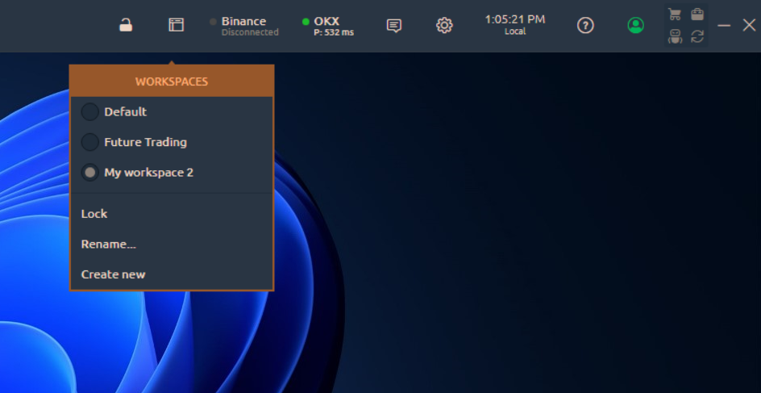

# Workspaces

The highest level of trading area organization — is a **Workspace**. This is the most general grouping layer that you may even don’t need most of the time.


3rd Dimension **automatically saves** every workspace into a local file **every five minutes** and right **before you exit** your app without requiring any manual action from the user. Additionally, you can press **Ctrl+S** to save your currently active workspace manually.


As a top-level grouping layer, Workspaces store all their contents in special local files. These files can be found in _**3rd Dimension-> Settings -> Workspaces**_ folder. Each file represents some workspace; both have the similar names. Technically, the workspace file is an XML-document containing all of the settings of all panels that are in the workspace.


How to create and save your custom workspace


**Workspaces manager** allows you to see, create, edit and delete your working environments as well as lock their modification. It is represented with the special icon, that opens the list of available Workspaces once being clicked.

<figure><figcaption>
Workspaces manager
</figcaption></figure>

The currently active workspace is marked with the color and has a blue dot on the left side of its name. You can switch the current workspace by left-clicking any of available item from the list. The bottom part of the list (after separator) consists of actions, referred to the currently active workspace and allows to:

* **Lock** — disables an ability to add, remove, move or resize any panel in current workspace;
* **Rename...** — invokes a pop-up screen where you can set up a new name for the current workspace;
* **Create new** — opens a pop-up screen with the new workspace creation form.

<figure><figcaption>
New workspace creation window
</figcaption></figure>

When creating the new workspace, you have an ability to specify its future name and select whether it should be Blank, once created, or should contain some predefined panels set.&#x20;


The list of Workspace templates will be constantly growing.&#x20;


You can also Remove any of Workspaces by clicking the “_**Trash**_” icon on the right side from Workspace name (icon appears while hovering the name).
