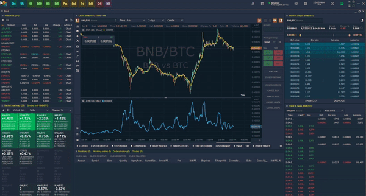

# 3rd Dimension Beta

**Beta Version.** When this option is activated, you will receive updates to new functionality that is still in testing. We strive for our traders to use fully working functionality, but for this, we need the help of each user. Therefore, we ask as many people as possible to use the Beta version to inform us about possible bugs that eluded our testers.

<figure><figcaption>
how to get beta updates
</figcaption></figure>

Activate the **"Use Beta Version"** option and [**update the platform**](platform-update.md) to the latest version.

<figure><figcaption></figcaption></figure>

