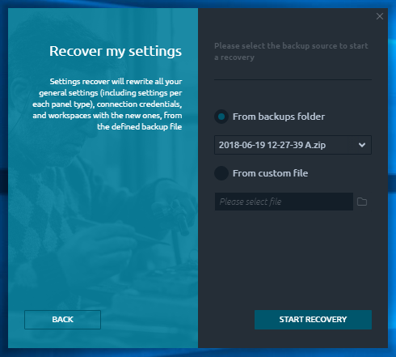

# Backup & restore manager

## General 

Backup & restore manager plugin allows to keep your settings safe and restore them in case of troubles with the application. This smart tool can backup your global settings, connections credentials, workspaces and per panel layout settings in one local file, that can be used later to restore them in several clicks.

.png>)

## Backup settings 

The backup process is easy and doesn’t require many explanations. Just select the path where your backup file will be stored (3rd Dimension backups folder by default; recommended) and press the **\[ CREATE BACKUP ]** button.

Once the process is started, you will see the progress screen, showing the backup process flow. When the backup will be finished you can press the **\[ FINISH ]** button to get to the starting screen. Each backup is created with the automatic name by the template: “Date Time.zip”.

You may find some backup files in 3rd Dimension Backup folder, containing the “**A**” letter at the end — these are the Automatic backups, periodically made by 3rd Dimension (daily, overridden each 5 min).

## Restore settings 

In case you want to restore some previous settings or wish to apply some custom settings (got from another 3rd Dimension user, that backed up its settings previously), follow the **\[ RECOVER SETTINGS ]** button.

Recover your settings in several clicks

Here you can find two ways of Backup file selection:

* From backups folder
* From custom file

The “_**Backups folder**_” is the default 3rd Dimension folder where it saves all automatically created backup files and proposes it to store yours, manually created. The Backup & restore manager checks this folder and displays you all the found files to import settings. You may also select some different location of your backup file, using the “_**From custom file**_” option.

Please make sure, that you are specifying the correct backup file (made by B\&R manager earlier) to avoid the problems with settings import and restore.

Once you select the required backup file and press the **\[ START RECOVERY ]** button, you will see the recovery process flow. When finished, you will be asked about the application restart. This is the required action to apply your newly imported settings.

In case of any problems with the backup file, B\&R manager will keep your current 3rd Dimension settings and inform you about it.

​
