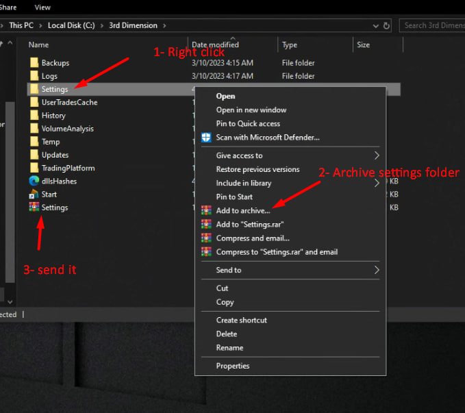
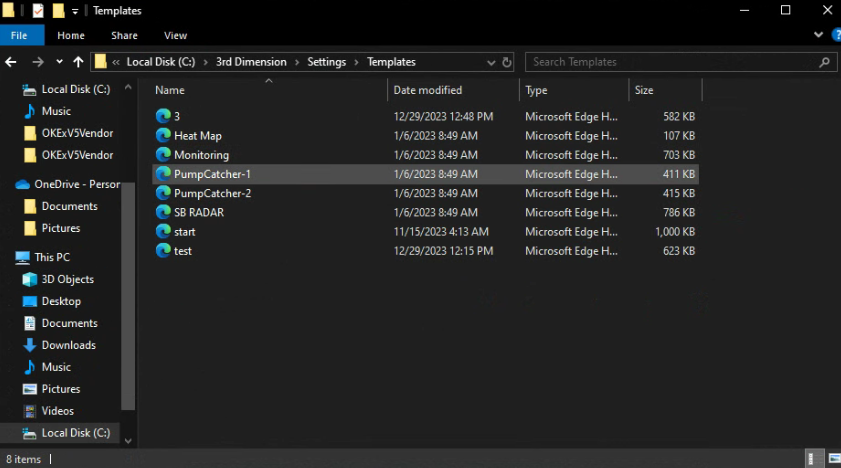
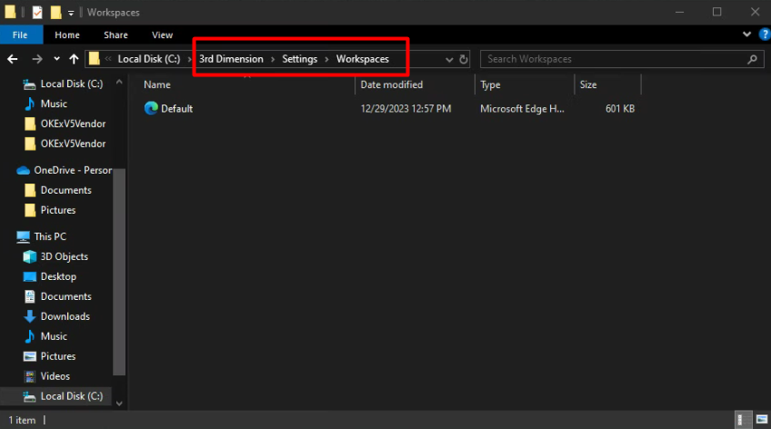

# Reset settings to default.

Settings folder contains all the workspaces, saved templates, as well as all the visual changes that have been applied to panels, indicators, drawing tools. Below we will consider the basic operations that you can perform with the settings folder for comfortable work with the platform.

* [**How to Reset All Settings to default**](reset-settings-to-default..md#how-to-reset-all-settings-to-default)
* [**How to provide Settings and Logs for developers (for checking an issue)**](reset-settings-to-default..md#how-to-provide-settings-for-developers-for-checking-an-issue)
* [**How to share your Templates with other traders**](reset-settings-to-default..md#how-to-share-your-templates-with-other-traders)
* [**How to share your  Workspaces with other traders**](reset-settings-to-default..md#how-to-share-your-workspaces-with-other-traders)
* [**How to copy all settings to other PC**](reset-settings-to-default..md#how-to-copy-all-settings-to-another-pc)

### How to Reset All Settings to default.

Sometimes all platform's settings need to be reset to default. To do this, close the platform, **Right-click** on 3rd Dimension icon and select **Open File Location** from the context menu.


You can save the current settings if you want to return to them later. Just rename your **Settings** folder to something else, like _**Settings\_My**_ etc.


<figure><figcaption></figcaption></figure>

A folder with the main files of the latest (installed) version of the program will open. \
&#xNAN;_**Go to the main folder of the platform.**_

<figure><figcaption></figcaption></figure>

_Rename the **Settings** folder_ (for example, Settings1 or Settings\_old). After you rename the folder, run the platform. The new Settings folder will automatically appear with default settings.

<figure><figcaption>
The new Settings folder will automatically appear with default settings
</figcaption></figure>


Before sending your Settings to developers for checking the problem, add the full settings folder to the ZIP or RAR archive and send it to **support@thirddimension.exchange** with a brief description of your problem.


### How to provide Settings for developers (for checking an issue)

Close the platform, **Right-click** on 3rd Dimension icon, and select **Open File Location** from the context menu.

<figure><figcaption></figcaption></figure>

A folder with the main files of the latest (installed) version of the program will open.\
&#xNAN;_**Go to the main folder of the platform.**_

<figure><figcaption></figcaption></figure>

Add the entire Settings folder to the archive and send this archive to us to check the problem.

<figure><figcaption></figcaption></figure>

#### How to provide Log files?

Moreover, for checking issues our developers can request Log Files. Please go to the **platform's main folder -> Logs -> Serilog -> send the latest file** or several latest files.&#x20;

<figure><figcaption></figcaption></figure>

### How to share your Templates with other traders


You can share your templates with other 3rd Dimension traders by sharing template files with them. Template files can be found in the folder **"3rd Dimension -> Settings -> Templates".**

The file to be transferred must be placed in a similar folder on another computer.


Recall that in the 3rd Dimension platform, all created templates are stored in the Control Center sidebar in the **"Templates"** group. Thus, you can launch any template from this location at any time with a single click. You can place your saved templates in the Favorites panel in the Control Center, just like any other default panel.

<figure><figcaption></figcaption></figure>

### How to share your Workspaces with other traders


This is done in exactly the same way as described above, except that we transfer a different file **\3rd Dimension\Settings\Workspaces**

The file to be transferred must be placed in a similar folder on another PC.


<figure><figcaption></figcaption></figure>

### How to copy all settings to another PC


[Copy the settings folder to another PC](reset-settings-to-default..md#how-to-provide-settings-for-developers-for-checking-an-issue) or COPY the entire 3rd Dimension folder to another PC. It is totally portable.

