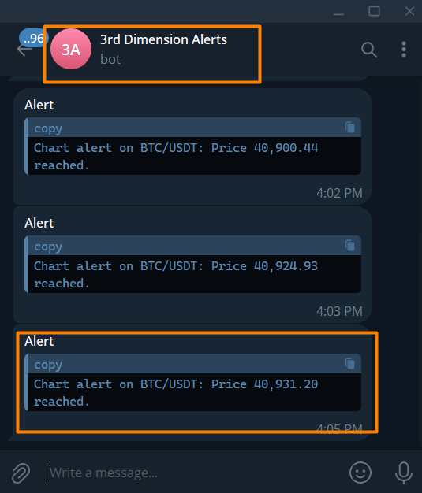

# 3rd Dimension Telegram Bot

3rd Dimension Alert Bot will send a message to your Telegram account about all events that you set in the platform. For example, set a price alert on the chart, and when the price will reach this level, a notification to the messenger will be sent.

<figure><figcaption></figcaption></figure>

## How to add Telegram Bot to your account?

To add a bot to the Telegram, open the platform's **General Settings -> Messengers -> Duplicate alerts to Telegram**.

<figure><figcaption>
Open General Setting for adding 3rd Dimension Telegram Bot
</figcaption></figure>

* Specify your personal chat ID, which you can find out by clicking on the **Get ID** button.&#x20;
* A new Chat ID Echo bot will open and it will show _**"Your Telegram Chat ID is: xxxxxxx".**_ Enter your chat ID in the corresponding field
* Connect to the 3rd Dimension Alert Bot.

<figure><figcaption></figcaption></figure>

## How to get notifications from Telegram Bot?

Telegram Bot sends notifications about alerts that you have set on active Charts or through a Watchlist. If you don't have any alerts yet, the bot will be in standby mode.

Once your alert is triggered, you will receive a telegram notification with the following text:&#x20;

_**"Chart alert on BTC/USDT: Price 40,931.20 reached."**_

<figure><figcaption></figcaption></figure>

 

<figure><figcaption></figcaption></figure>

If you activate the '**Duplicate Trading Notifications to Telegram'** option, all trading messages will be automatically forwarded to Telegram.

