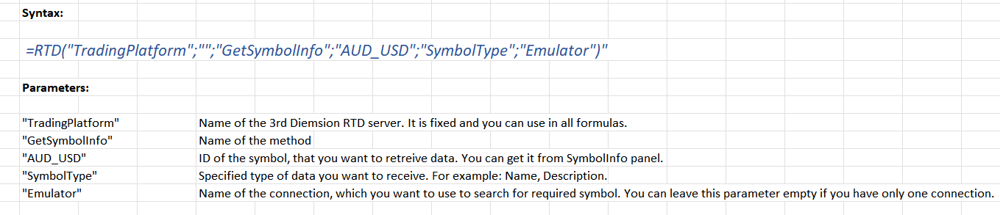

# Excel and RTD function

Starting from version 1.35 3rd Dimension supports **Real-Time Data (RTD)** for sending data and other market information to Microsoft Excel®. This feature opens up many opportunities for creating custom displays and other ways to manage your workflow better.&#x20;

RTD is a newer protocol that offers several advantages over DDE, including more flexibility and better performance and reliability.

We prepared the spreadsheet that outlines the basic syntax of RTD formulas with details of more complex formulas. A collection of popular RTD formulas is included, which you can copy and paste into your spreadsheet. [**Download the sample file.**](https://docs.google.com/spreadsheets/d/1GNWXY6od0o6l-0PpidAQbAYcFes2Iz0f/edit?usp=sharing\&ouid=115255693293676810295\&rtpof=true\&sd=true)

Here is the General Syntax for getting symbol info via RTD function:


<figure><figcaption></figcaption></figure>

## **How to activate the RTD function in 3rd Dimension platform**


For the function to work properly, **3rd Dimension platform and Excel must have the same version — 64-bit or 32-bit**


1- Launch Excel and open the Task Manager to check the version of Excel (32-bit or 64-bit). The platform should have the same version to work with the RTD function correctly.

<figure><figcaption></figcaption></figure>

2- Go to the [**General Settings**](../../general-settings/) of the platform, then to the _<mark style="background-color:blue;">**Excel RTD**</mark>_ section, and tick off _**"Enable Microsoft Excel RTD"**_

<figure><figcaption><p>Activation of RTD function in 3rd Dimension</p></figcaption></figure>

Also in the settings, there are two important settings:

* **Custom RTD formula name** — depending on the language of your operating system, the name of the RTD function in Excel may be called differently. The original name of the function in the English version of Excel is RTD, but for the Russian version it's called "ДРВ".
* **Custom argument separator** — the separator that participates in the formula. It depends on the localization of your operating system. Get to know [how to check argument separator in your system](broken-reference).

3. For the RTD function to work correctly, you need to **download and extract** the '<mark style="background-color:orange;">**tradingplatform.rtdserver.zip**</mark>' archive as an administrator. You can find the file at [https://updates.quantower.com/misc/RTD/tradingplatform.rtdserver.zip](https://updates.quantower.com/misc/RTD/tradingplatform.rtdserver.zip).


**Important!** The archive must be extracted to any convenient location on your PC and should not be deleted. All current and future updates of 3rd Dimension will use these files.


4. After unpacking the archive, run '<mark style="background-color:orange;">**register.cmd**</mark>' as an administrator. It's important to ensure that Excel is closed during this process!

<figure><figcaption><p>Run the "register.cmd' file as an administrator</p></figcaption></figure>

5. Once you've completed the previous steps, you can launch Excel and begin using the RTD function with 3rd Dimension.

### How to get the instrument data from 3rd Dimension? <a href="#how-to-get-the-instrument-data-from-quantower" id="how-to-get-the-instrument-data-from-quantower"></a>

#### 1. Getting data through copying a formula <a href="#id-1.-getting-data-through-copying-a-formula" id="id-1.-getting-data-through-copying-a-formula"></a>

The easiest way to get data to Excel is to copy the necessary data through the panel context menu. For example, after activating RTD, an additional item in the context menu will appear in the Watchlist panel — **Copy RTD Formula**.

* Select a necessary symbol or multiple symbols, right-click and select **Copy RTD Formula**. You can copy formulas for specific columns or for all columns.

<figure><figcaption></figcaption></figure>

* Go to Excel and paste the copied formulas. Now the data will be updated automatically.

<figure><figcaption><p>Broadcasting real-time data to Excel</p></figcaption></figure>


You may notice that the data is updated with some delay. This is a throttling interval that is set by default in Excel (2000 milliseconds). If you want to[ increase the speed of updating data, read the instructions on how to do it.](changing-rtd-throttle-interval-in-excel.md)


#### 2. Getting data through writing a formula <a href="#id-2.-getting-data-through-writing-a-formula" id="id-2.-getting-data-through-writing-a-formula"></a>

When retrieving instrument data using RTD, you need to specify the ID of the instrument and the properties you want to retrieve.

RTD formula uses the following basic structure:

```
=RTD("TradingPlatform";"";"Param1";"Param2";"Param3";....")
```


The second parameter is the name of the external server running the RTD Server. As the 3rd Dimension RTD Server always runs locally, you must omit a value for the second parameter or supply an empty string (“”). However, you must account for the parameter in the formula.


### Examples of the most popular RTD formulas with description&#x20;

Examples of the most popular RTD formulas are described below with description of the basic syntax by the example of Binance exchange. Using them, you can get exactly the data you need for analysis and paste into your spreadsheet. You can also download these examples from this Excel file.

### 1.GetSymbolInfo - information about a specific symbol


Provides access to specific symbol information such as Description, **ExchangeName, NettingType and others**. You can simply copy/paste this formula for use in Excel files or get it directly from the Symbol Information panel for the selected symbol. Right-click on the panel and select the menu option: "**Copy RTD Formula**" -> "Value".


```
=ДРВ("tradingplatform";"";"GetSymbolInfo";"1INCHBTC";"Name";"Binance Spot")

=ДРВ("tradingplatform";"";"GetSymbolInfo";"1000LUNCBUSD";"Name";"Binance USDT-M Futures")

=ДРВ("tradingplatform";"";"GetSymbolInfo";"1INCHUSDT_SPOT";"Name";"Bybit")

=ДРВ("TradingPlatform";"";"GetSymbolInfo";"10000NFTUSDT_SWAP";"Name";"Bybit")

=ДРВ("TradingPlatform";"";"GetSymbolInfo";"BTCUSDT";"SymbolType";"Binance Spot")
```

**Options**

| Options                      | Description                                                                                                                                         |
| ---------------------------- | --------------------------------------------------------------------------------------------------------------------------------------------------- |
| **"TradingPlatform"**        | 3rd Dimension RTD server name. You can use it in all formulas.                                                                                      |
| **"GetSymbolInfo"**          | Name of method                                                                                                                                      |
| **"BTCUSDT"**                | The ID of the symbol for which you want to get data. You can get it from the SymbolInfo panel.                                                      |
| **"SymbolType"**             | Specifies the type of data you want to receive. For example: Name, Description.                                                                     |
| **"Binance USDT-M Futures"** | The name of the connection you want to use to search for the desired character. You can leave this parameter blank if you only have one connection. |

#### &#x20;<a href="#id-2-getaccouninfo-informaciya-o-konkretnoi-uchetnoi-zapisi" id="id-2-getaccouninfo-informaciya-o-konkretnoi-uchetnoi-zapisi"></a>

<figure><figcaption></figcaption></figure>

<figure><figcaption></figcaption></figure>

### 2. GetAccounInfo - information about a particular account <a href="#id-2-getaccouninfo-informaciya-o-konkretnoi-uchetnoi-zapisi" id="id-2-getaccouninfo-informaciya-o-konkretnoi-uchetnoi-zapisi"></a>


Provides access to specific account information such as name, balance, NettingType, and others. You can simply copy/paste this formula for use in Excel files or get it directly from the Account Information panel for the selected account. Right-click on the pane and select the menu option: "Copy RTD Formula" -> "Value".


```
=ДРВ("tradingplatform";"";"GetAccountInfo";"binance";"Balance";"Binance USDT-M Futures")

=ДРВ("tradingplatform";"";"GetAccountInfo";"binance";"DOTavailableBalance";"Binance USDT-M Futures")

=ДРВ("tradingplatform";"";"GetAccountInfo";"binance";"hedgeMode";"Binance USDT-M Futures")

=ДРВ("tradingplatform";"";"GetAccountInfo";"3111865";"Balance";"Bybit")

=ДРВ("tradingplatform";"";"GetAccountInfo";"3111865";"openPositions";"Bybit")

=ДРВ("tradingplatform";"";"GetAccountInfo";"3111865";"Id";"Bybit")
```

### **3. GetMarketData -** Bid, Ask, Last, Open, High

```
=ДРВ("tradingplatform";"";"GetMarketData";"1INCHUSDT_SPOT";"Last";"Bybit")

=ДРВ("tradingplatform";"";"GetMarketData";"10000NFTUSDT_SWAP";"Last";"Bybit")

=ДРВ("tradingplatform";"";"GetMarketData";"BTCUSDT";"Last";"Binance Spot")

=ДРВ("tradingplatform";"";"GetMarketData";"1000LUNCBUSD";"Last";"Binance USDT-M Futures")

=ДРВ("tradingplatform";"";"GetMarketData";"1INCHUSDT_SPOT";"ChangePercentage";"Bybit")

=ДРВ("tradingplatform";"";"GetMarketData";"10000NFTUSDT_SWAP";"ChangePercentage";"Bybit")

=ДРВ("tradingplatform";"";"GetMarketData";"1INCHBUSD";"ChangePercentage";"Binance Spot")

=ДРВ("tradingplatform";"";"GetMarketData";"1000LUNCBUSD";"ChangePercentage";"Binance USDT-M Futures")

```

| _**Options**_                | Description                                                                                                                                         |
| ---------------------------- | --------------------------------------------------------------------------------------------------------------------------------------------------- |
| **"TradingPlatform"**        | 3rd Dimension RTD server name. You can use it in all formulas.                                                                                      |
| **"GetMarketData"**          | Name of method                                                                                                                                      |
| **"BTCUSDT"**                | The ID of the symbol for which you want to get data. You can get it from the SymbolInfo panel.                                                      |
| **"Bid"**                    | Specifies the type of data you want to receive. For example: Bid, Ask, Last, Open, High                                                             |
| **"Binance USDT-M Futures"** | The name of the connection you want to use to search for the desired character. You can leave this parameter blank if you only have one connection. |


<figure><figcaption></figcaption></figure>

### 4. GetLevel2Data - Level2 <a href="#id-4-getlevel-2-data-level2-dannye-glubiny-rynka" id="id-4-getlevel-2-data-level2-dannye-glubiny-rynka"></a>

Provides access to Tier 2 data for a specific symbol. You can simply copy/paste this formula and use it in your Excel files.

```
 =ДРВ("tradingplatform";"";"GetLevel2Data";"BTCUSDT";"BidSize";"0";"Binance Spot")

=ДРВ("tradingplatform";"";"GetLevel2Data";"BTCUSDT";"BidSize";"0";"Binance USDT-M Futures")

=ДРВ("tradingplatform";"";"GetLevel2Data";"BTCUSDT_SPOT";"BidSize";"0";"Bybit")

=ДРВ("tradingplatform";"";"GetLevel2Data";"10000NFTUSDT_SWAP";"BidSize";"0";"Bybit")
```

_**Options**_

| _**Options**_                | Description                                                                                                                                         |
| ---------------------------- | --------------------------------------------------------------------------------------------------------------------------------------------------- |
| **"TradingPlatform"**        | 3rd Dimension RTD server name. You can use it in all formulas.                                                                                      |
| **"GetLevel2Data"**          | Name of method                                                                                                                                      |
| **"BTCUSDT"**                | The ID of the symbol for which you want to get data. You can get it from the SymbolInfo panel.                                                      |
| **"BidSize"**                | The specified type of data you want to receive. For example: Bid, Ask, BidSize, AskSize.                                                            |
| **"0"**                      | The sequence number of the level in the Depth of Market. Starts with 0.                                                                             |
| **"Binance USDT-M Futures"** | The name of the connection you want to use to search for the desired character. You can leave this parameter blank if you only have one connection. |

<figure><figcaption></figcaption></figure>

### 5. GetHistory - history for the specified symbol <a href="#id-5-gethistory-istoriya-dlya-ukazannogo-simvola" id="id-5-gethistory-istoriya-dlya-ukazannogo-simvola"></a>

Returns the history for the specified character, aggregation and date range. You can simply copy/paste this formula and use it in your Excel files.

```
=ДРВ("tradingplatform";"";"GetHistory";"BTCUSDT";"1Day";"Low";"10Day";"0";"Last";"Binance Spot")

=ДРВ("tradingplatform";"";"GetHistory";"BNBUSDT";"1Minute";"Close";"30Minute";"0";"Last";"Binance USDT-M Futures")

=ДРВ("tradingplatform";"";"GetHistory";"BTCUSDT";"5Minute";"Open";"300Minute";"0";"Last";"Binance USDT-M Futures")

=ДРВ("tradingplatform";"";"GetHistory";"ADAUSDT";"1Hour";"Low";"24Hour";"0";"Last";"Binance Spot")

=ДРВ("tradingplatform";"";"GetHistory";"BTCUSDT_SPOT";"1Hour";"Low";"24Hour";"0";"Last";"Bybit")

=ДРВ("tradingplatform";"";"GetHistory";"10000NFTUSDT_SWAP";"1Hour";"Low";"24Hour";"0";"Last";"Bybit")
```

_**Options**_

| _**Options**_                | Description                                                                                                                                         |
| ---------------------------- | --------------------------------------------------------------------------------------------------------------------------------------------------- |
| **"TradingPlatform"**        | 3rd Dimension RTD server name. You can use it in all formulas.                                                                                      |
| **"GetHistory"**             | Name of method                                                                                                                                      |
| **"BTCUSDT"**                | The ID of the symbol for which you want to get data. You can get it from the SymbolInfo panel.                                                      |
| **"1Day"**                   | Aggregation type: 1 day, 3 days, 5 minutes, etc. Available aggregates:Tick, Second, Minute, Hour, Day, Week, Month, Year.                           |
| **"Close"**                  | Specifies the type of data you want to receive. For example: Open, High, Low, Close, Volume, Bid, Ask.                                              |
| **"10Day"**                  | Required history range: 10 days, 300 minutes, etc. Available ranges: Minute, Hour, Day, Month, Year.                                                |
| **"0"**                      | The index of the bar / tick in the returned history array. 0 means the newest bar.                                                                  |
| **"Last"**                   | Bid, Ask, Last history type. Leave the field empty to get the default history for the specified character.                                          |
| **"Binance USDT-M Futures"** | The name of the connection you want to use to search for the desired character. You can leave this parameter blank if you only have one connection. |

<figure><figcaption></figcaption></figure>

## **Frequently Asked Questions**

### **How to check argument separator?**

For Windows 10:&#x20;

* go to **Start >type Control Panel  and press enter > Region**
* click **Additional Settings**
* for **List Separator** check the argument. It must be the same as in RTD settings.

<figure><figcaption></figcaption></figure>

<figure><figcaption></figcaption></figure>
