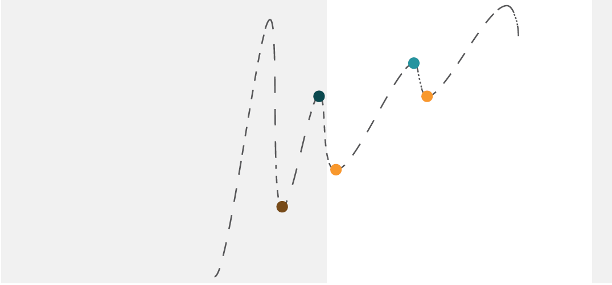
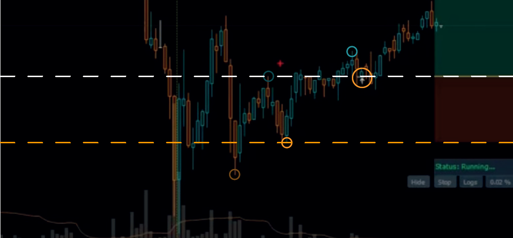
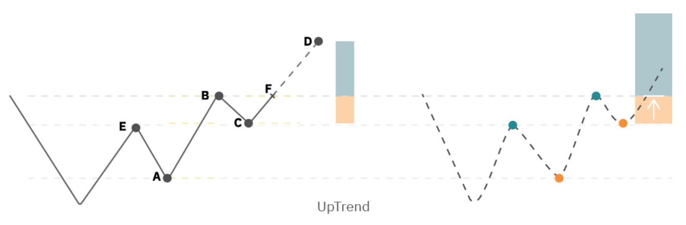
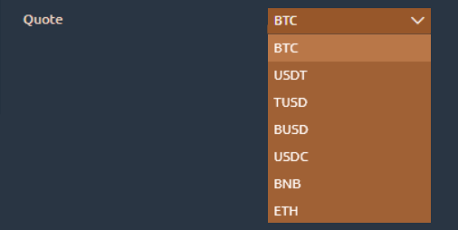

# Breakout Catcher Bot

Breakout Catcher simplifies the implementation of SBS (Successive Higher Lows) Scanner opportunities with automated precision, eliminating the need for manual configuration of Trading Personal Assistances (TPAs) and settings entry. This trading bot identifies opportunities when the market's recent waves form a higher low, signifying a potential upward trend. To seize this chance, Breakout Catcher dynamically adds a TPA with the enter price set to the last peak, Stop Loss (SL) to the last trough of the current wave, and Take Profit (TP) calculated based on user-defined settings (explained later). The entry event is strategically timed on bar retest.

<figure><figcaption></figcaption></figure>

Despite primarily targeting resistance breakout opportunities, Breakout Catcher introduces a unique approach. It delays adding the TPA until the first condition (considering the on-bar retest option) is fulfilled—specifically, after a bar closes higher than the enter price. This deliberate delay safeguards against prematurely consuming allotted TPAs for chances that may take time to meet the initial condition. This nuanced strategy enhances user control, maximizes efficiency, and optimizes the utilization of added TPAs.

In the following documentation pages, we will delve into the specific features, parameters, and settings that empower users to customize and harness the full potential of Breakout Catcher Bot in their trading endeavors.

<figure><figcaption></figcaption></figure>

### Breakout Catcher Bot Settings:

<figure><figcaption></figcaption></figure>

To add the Breakout Catcher Bot to your trading strategy, follow these steps:

1\_Click on the 3rd Dimension Symbol: Navigate to the upper-left side of the trading platform and locate the 3rd Dimension symbol. Click on it to access additional features and functionalities.

2\_Choose the Symbol "STM" to Open the Strategies Manager: Within the 3rd Dimension features, select the symbol labeled "STM." This action opens the Strategies Manager, where you can manage and configure various trading bots and strategies.

3\_Click on the "+" Symbol to Visualize All Available Bots/Strategies: Once in the Strategies Manager, look for the "+" symbol and click on it. This action reveals a list of all available trading bots and strategies that can be integrated into your trading setup.

4\_From Strategies, Choose "Breakout Catcher": In the list of available strategies, locate and click on "Breakout Catcher." This selection adds the Breakout Catcher Bot to your trading setup, enabling you to access and customize its settings.

<figure><figcaption></figcaption></figure> <figure><figcaption></figcaption></figure>

When you choose Breakout Catcher from strategies and press the settings icon, you will see the settings divided into the next groups:

<figure><figcaption>
Breakout Catcher Settings
</figcaption></figure>

## 1: View

<figure><figcaption></figcaption></figure>

#### 1.1 Instance name:

This section allows users to assign a unique name to their current instance of the Breakout Catcher Bot. The instance name is a user-defined label that helps differentiate various bot configurations, especially for users managing multiple instances simultaneously and will be the first part of the creator name in the Trading Personal Assistances (TPAs) added by this instance of the bot.

## 2: Scan Parameters

<figure><figcaption>
Breakout Catcher Scan Parameters
</figcaption></figure>

**2.1 Start Bot At Bitcoin Price (Immediately If 0):**

This field provides users with the flexibility to choose when the bot should start scanning the market. If a specific Bitcoin price is set, the bot will initiate its scanning strategy only when the market reaches the specified price. Leaving it empty or setting it to 0 triggers an immediate start.

**2.2 Loading Speed:**

<figure><figcaption>
Loading Speed
</figcaption></figure>

The loading speed determines how quickly the bot scans and adds trades. Users can select from three options: low, medium, and fast. This choice influences the speed at which the bot responds to market changes.


This option should be used carefully based on exchange requests rate to avoid getting too many requests error.


**2.3 Period:**

Users can set the timeframe period (Minute, Hour, Day, or Week) to which the bot will apply its strategy for identifying potential trades. Selecting an appropriate timeframe aligns the bot with your preferred trading horizon.

**2.4 Trade Size:**

<figure><figcaption></figcaption></figure>

This drop-down list (Small, Large) enables you to choose the size of market changes that will be considered as potential indications of a shift in the wave direction.

**2.5 Build Base:**

<figure><figcaption></figcaption></figure>

Choose between High/Low or Open/Close as the reference points for determining changes in the market base. This setting influences the bot's decision-making process regarding the formation of waves.

**2.6 Account:**

This drop-down menu lists all connected accounts on the platform, enabling users to choose the account through which the bot will execute trades.

**2.7 Bot Mode:**

<figure><figcaption></figcaption></figure>

Users specify the bot's mode as either "Long" or "Short," indicating whether the bot should search for opportunities in a bullish or bearish market.

**2.8 Trading Type:**

<figure><figcaption></figcaption></figure>

This setting allows users to define whether the bot should open trades in the spot or futures market, providing flexibility based on the user's preferred trading environment.

**2.9 Enter Pattern:**

<figure><figcaption></figcaption></figure>

This parameter allows the user to specify the market condition for potential trades. Choose from:

**WPattern**: Last waves form a higher low and a lower high. Usage: This option is suitable when the user is looking for a market situation where the most recent waves demonstrate a higher low followed by a lower high. The bot considers this pattern as a potential opportunity.

<figure><figcaption>
 W Pattern
</figcaption></figure>

**UpPattern**: Last waves form a higher low and a higher high. Usage: This option is relevant when the user is searching for an upward trend scenario. The bot identifies opportunities where the last waves demonstrate a higher low followed by a higher high.

<figure><figcaption>
Up Trend
</figcaption></figure>

**All:** Considers both conditions. Usage: This option is more inclusive, triggering a potential opportunity whenever there is a higher low, regardless of the high's situation. It combines both WPattern and UpPattern conditions.


**How to Choose:** Selecting the appropriate "Enter Pattern" is crucial as it determines the specific market structure the user will focus on. The user should consider the current market conditions, their trading preferences, and the type of opportunities they want the bot to identify. If the user is interested in breakout chances following specific wave patterns, they can choose either WPattern or UpPattern. If they want the bot to be more flexible and capture opportunities regardless of the high's situation, they can opt for "All."


**2.10 Quote:**

<figure><figcaption></figcaption></figure>

Users can select their preferred quote currency from a drop-down menu (BTC, USDT, TUSD, BUSD, BNB, ETH) for trading pairs.

## 3: TPAs Parameters

<figure><figcaption>
 TPAs Parameters
</figcaption></figure>

**3.1 Added TPAs Without Run:**

When checked, this option allows the bot to open Trade Personal Assistants (TPAs) without immediately executing them. This feature provides users with additional control over the timing of their trades.

**3.2 Without Exit:**

Checking this box deactivates the Exit Price from the TPAs, allowing for a behavior where TPAs do not have a predefined exit point.

**3.3 Default TPA Setting:**

<figure><figcaption></figcaption></figure>

Users can choose from predefined TPA settings or select from five additional custom settings (Setting0, Setting1, Setting2, Setting3, Setting4) to tailor TPAs to their trading preferences.

**3.4 TP Calculation:**

<figure><figcaption></figcaption></figure>

This parameter defines how the Take Profit (TP) value is determined for each trade. It influences the strategy the Breakout Catcher Bot uses to set TP levels. Here are the available options:\
\
**TPSL Ratio:** Set the TP value to the closest resistance (peak) that achieves the specified TP/SL ratio or higher. Usage: This option is useful when you want the TP level to be determined based on a predefined ratio between Take Profit and Stop Loss.\
\
**WTarget:** Adds the value of the last up wave to the enter price. Usage: This option calculates TP by adding the value of the last upward wave to the enter price. It is suitable for traders who want to capture gains based on recent market movements.\
\
**AB=CD:** Adds the last up wave (AB) to the last trough (C), setting TP at point D. Usage: This option calculates TP by adding the last upward wave (AB) to the last trough (C), effectively setting TP at point D. It is a pattern-based approach.


How to Choose: Select the TP calculation method based on your trading preferences and the desired strategy. If you prefer a ratio-based approach, choose "TPSL Ratio." If you want to capture gains based on recent upward movements, go for "WTarget." For pattern-based TP calculation, opt for "AB=CD."


**3.5 Enter Option:**

<figure><figcaption></figcaption></figure>

Select the strategy for entering positions. Options include **OnResistanceRetest** and OnOrderBlockRetest. If **OnOrderBlockRetest** is selected, additional parameters related to order block identification will be available.

**3.6 Order Block Time Frame (if OnOrderBlockRetest is selected):**

Choose the time frame for finding the order block when OnOrderBlockRetest is selected as the entering strategy.

**3.7 Quantity Option:**

This parameter allows users to define how the quantity of each trade is determined for every (TPA) . There are two options available:\
\
**Quote Quantity (Per TPA):**&#x45;nables the user to manually set the quantity of the trade for each TPA. Usage: This option is ideal for users who prefer a hands-on approach, giving them the ability to precisely specify the amount of the quote currency they want to allocate for every TPA.\
\
**Risk Per Trade Percentage:** the parameter transforms (3.8) into "Risk Per Trade Percentage," allowing the user to set the quantity as a percentage of the trade's overall risk.\
Usage: This option introduces a dynamic approach to trade sizing. Users can set the quantity as a percentage of the total risk they are willing to undertake for each trade, ensuring flexibility based on predefined risk management parameters.


How to Choose: Opt for "Quote Quantity (Per TPA)" if you prefer manual control over trade sizes, allowing you to specify the exact amount for each TPA. Alternatively, select "Risk Per Trade Percentage" for a dynamic approach that adjusts the quantity based on the predefined risk percentage.



Example Usage: Scenario: A user employing a meticulous risk management strategy may choose "Risk Per Trade Percentage" and set the percentage based on their overall risk tolerance for each trade. On the other hand, a user who prefers a fixed trade size may opt for "Quote Quantity (Per TPA)" to manually specify the quantity.


**3.8 Quote Quantity (Per TPA) or Risk Per Trade Percentage:**

Depending on the selected Quantity Option in (3.7), this field is either for manually entering the quote quantity per TPA or setting the risk percentage per trade.

3.9 Leverage:

This parameter allows users to set the level of leverage for trades executed by the Breakout Catcher Bot. Leverage amplifies both profits and losses, enabling users to control larger positions with a smaller capital amount. For instance: Users can input a specific leverage value (e.g., 10x), determining the ratio of borrowed funds to their own capital.

**3.10 Exit Trigger Margin Option:**

<figure><figcaption></figcaption></figure>

This parameter in the context of Trading Personal Assistance (TPA) determines the method for setting the trigger price when closing a trade. Two options are available:

**Without Margin**: Sets the trigger price to the same level as the enter price. Usage: This option simplifies the exit strategy by closing the trade at the same price level where it was entered.

<figure><figcaption></figcaption></figure>

**Candle Upper Shadow**: Sets the trigger price to the open or close (whichever is higher) of the candle forming the last peak. Usage: This option considers the upper shadow of the candle forming the last peak, setting the trigger price to the higher of the open or close.

<figure><figcaption></figcaption></figure>

**Fib Based Margin**: Sets the trigger price to half of the current upward wave, unless it surpasses the enter price. In that case, it's set to the enter price. This value. Usage: This option incorporates Fibonacci retracement levels, offering a dynamic exit strategy based on the current market conditions.

<figure><figcaption></figcaption></figure>


How to Choose: Opt for "Without Margin" for a straightforward exit strategy at the entry price. Choose "Candle Upper Shadow" for an exit strategy based on the upper shadow of the last peak's candle. Consider "Fib Based Margin" for a dynamic exit tied to Fibonacci retracement levels.



Example Usage: Scenario: A user desiring a dynamic exit strategy that adapts to market movements might choose "Fib Based Margin." This option allows the exit trigger to adjust dynamically with each upward wave, potentially maximizing gains in trending markets.


**3.11 TPA Manager Color:**

Choose the color for TPAs in the manager to differentiate TPAs created by different instances of the bot.

## 4: Filters Parameters

<figure><figcaption>
Breakout Catcher Filters Parameters
</figcaption></figure>

**4.1 Excluded Bases:**

Users can input bases or a list of bases that they do not want the bot to scan, offering a level of customization to tailor the bot's scanning preferences.

**4.2 Exclusive Pairs:**

Users can input pairs or a list of pairs that they want the bot to exclusively scan, allowing for targeted market analysis.

**4.3 Min 24H Quote Vol:**

This numerical field lets users filter pairs based on the minimum 24-hour quote volume, ensuring that the bot focuses on actively traded assets.

**4.4 Max 24H Quote Vol:**

This numerical field lets users filter pairs based on the maximum 24-hour quote volume, helping to avoid overly volatile or illiquid assets.

**4.5 Max Num Of Added TPAs:**

Users can specify the maximum number of TPAs that the bot will find with the specified strategy, allowing for control over the quantity of potential trades.

**4.6 Max Num Of Entered TPAs:**

Users can specify the maximum number of TPAs that the bot will allow to enter at the same time with the specified strategy, providing control over the number of active trades.

## 5: Extra Parameters

<figure><figcaption>
Breakout Catcher Extra Parameters
</figcaption></figure>

**5.1 Save Settings As Default:**

This option allows users to save the current settings as the default configuration for future instances, streamlining the setup process.

**5.2 Emergency Stop:**

This button, when pressed, close all TPAs (stop and close its deals) that were opened using the current strategy. It serves as an emergency measure to quickly exit trades in certain situations.

## Bot Metric Information:

<figure><figcaption></figcaption></figure>

**1\_Bot Name:** Identifies the name assigned to the Breakout Catcher Bot for easy reference.

**2\_Version:** Denotes the specific version of the Breakout Catcher Bot, indicating the iteration or release.

**3\_Instance Name:** Represents the unique identifier or name given to the specific instance of the Breakout Catcher Bot.

**4\_Scanners:** Indicates the number of trading pairs that have been scanned by the Breakout Catcher Bot in its current operational state.

**5\_TPAs (Trading Personal Assistances):** Reflects the total number of Trading Personal Assistances that are currently open as part of the Breakout Catcher Bot's active trading strategy.

**6\_Current Entered TPAs:** Specifies the count of TPAs that have been entered and are actively being managed by the Breakout Catcher Bot at the current moment.

**7\_Total Profit %:**  Quantifies the overall profit percentage generated by the Breakout Catcher Bot over its operational history.

**8\_Working Time:** Represents the total duration for which the Breakout Catcher Bot has been actively scanning, entering TPAs, and executing its trading strategy.

**9\_Run Date/Time:** Displays the date and time when the Breakout Catcher Bot was last initiated or its current operational session began.

## Notes:


⦁ After a symbol’s scanner finishes the scanning part and starts tracking, you will have the next log for that symbol (for example for XTZ-USDT).\
.png>)



⦁ When a TPA is added for a symbol you will have the next log (for example for MAHA-USDT) and this symbol will no longer be tracked (only one TPA for each symbol is added at the same time).\
.png>)



⦁ After a TPA is stopped or removed, its symbol will be retraced to look for a new chance for it and you will have the next log (for example for XCH-USDT).\
.png>)



⦁ When any TPA is stopped for some reason (other than finishing or manually stopped), the TPA will be removed and you will have an info message in the log with the symbol and the stop reason, the next are examples of some reasons the TPA may be removed for.\
.png>)



⦁ If you are in “Without Run” mode and a TPA added went out of bounds (price closed higher than TP or lower than SL) before you run it, then it will be removed and you will have the next log (for example for ATOM3S-USDT).\
.png>)



⦁ If the connection was lost while bot is working then you will have the next message on the log.\
.png>)



and it will restore connection and tracking after connection goes back and log the disconnection time.\
.png>)


⦁ The TPA settings that will always be taken from bot and not from your default TPA settings are the following:

* Strategy: Buy Support.
* Strategy Behavior: one time.
* EPOrderType: local limit.
* Enter Trigger Price (%): 0%.
* Local Limit Trigger Price (%): 20%.
* Exit Price: the same as enter price.

Also the settings that are specified from bot settings.
