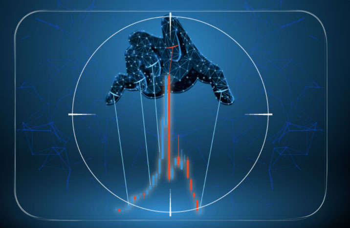
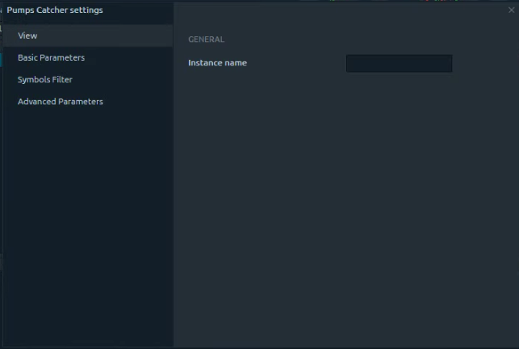
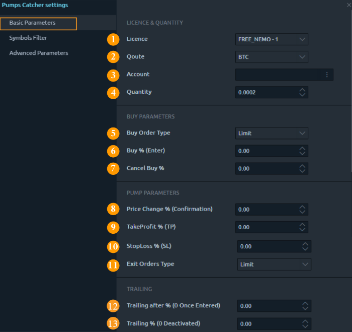
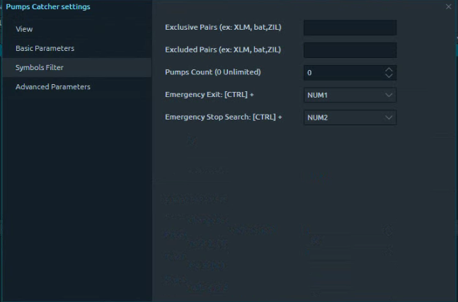
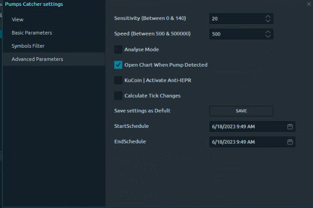

# Pumps Catcher

<figure><figcaption>
PumpCatcher Bot
</figcaption></figure>

### About Pump & Dump

In the plot of pump & dump, some traders agree to manipulate prices through the coordinated purchase of one of the currencies and when external investors notice the large upsurge of that currency, those coordinated groups start selling at prices higher than the entry prices and thus collecting profits, and in these short moments, we have opportunities for profit.

There are many groups and channels, whether on Telegram or other, that regulate this movement. The organizers start buying the currency silently and at low prices. After that, they announce the currency for paid groups and channels minutes before the Pump occurs, then they announce the currency to the unpaid public and groups and then happen The Fomo process and the prices rise and the regulators sell during this high rise, and here comes the role of the Bump Catcher, who notices an abnormal change in price and makes purchases at the beginning of this rise and before the FOMO and then selling with profits.

\
**Notice**:

The manipulative process of "Pump and Dump" is not a legal process and the US Securities and Exchange Commission (SEC) considers it fraud in the world of banknotes, but there are no rules governing the world of digital currencies.

Also, the Pump Catcher bot is not a tool for making "Pump & Dump" in any market and does not cooperate with any groups or channels on any platform, it simply notices an unusual change in price, so it hunts the opportunity and allows you to buy and sell quickly at a predetermined percentage that you choose.

\
What is The Pump Catcher bot?
-----------------------------

It is a program located on the 3rd Dimension Platform that allows you to benefit from the rapid price movements that occur in the market during the organized pump. All you have to do is to start the bot five minutes before the pump time and put the appropriate settings and the bot buys and sells the currency that the bump occurred on.

The Pump Catcher role, in brief, is that it observes any abnormal change in the price and makes purchases at the beginning of the price rise before the FOMO occurs and then sells (according to the percentage that you set in the settings before you start it), taking into consideration to sell before the fall in price or during the gaining Profits stage.

**Disclaimer text**: Digital assets and cryptocurrencies are exposed, like others, to price fluctuations up and down, we advise you not to put all your savings in them, and to determine wisely the appropriate amount for you, the recommendations we provide are based on expectations that could be right or wrong, and you are solely responsible for your investment decision in accepting these recommendations. This group does not require any money or digital currency transfer from any subscriber, nor does it manage an account for anyone, nor does it ask for information about your account on any platform and we are not responsible for any person who claims that or responds to any such invitation.

## How to open Pump Catcher?&#x20;

To open Pump Catcher:

1-   Press the pyramid icon button\
2-   Choose "strategy Manager"

<figure><figcaption>
open pump catcher
</figcaption></figure>

<figure><figcaption></figcaption></figure>

Pumps Catcher Settings

<figure><figcaption></figcaption></figure>

<figure><figcaption></figcaption></figure>

They are two sections:

A.      Basic Parameters

The default options are set carefully, calculated, and based on experiments, so it is advised not to modify them or the advanced settings if you do not have sufficient experience.

You will notice that the default settings differ when the "Buy order type" is changed from limit to market.

B.      Advanced Parameters.

A. Basic Parameters

The first case when the order type: Limit

1\.  License

&#x20;

This option is intended for choosing the type of subscription or package that you want to use the Pump Catcher on, it is possible that you have purchased the bot separately or have purchased one of the saving packages such as "All in One" or "Premium" which include the "Shark Pumps Catcher" package on them, Therefore if you have more than one package, you can run more than one bot at the same time separately.

In the example shown in the picture, suppose you have a subscription to the "All in One" package, the 2 "Dolphin" packages, and the "Whale" Package, they will appear in this box as follows:

Then you can run 4 bots at the same time, by opening the first bot and select for example that you want to run it on "All in one" and then you start it by clicking on "Run"

In our example, as for the Dolphin package, you can run it twice separately, by opening "Strategy" again each time and selecting Dolphin in the "License" box then press "Run" and the same thing for the last package "Whale".

2\.  Quote

The currency in which the entry process will be made into the pump and you can choose between BTC, ETH, and USDT.

3\.  Account

It has to be a Binance account

4\.  Buy Order Type

You can choose between "Limit" or "Market"

5\.  Quantity

It is the value of the balance or the amount of currency that you will join the pump after the type of currency is specified in the "Quote" box.

In the earlier copies, you had to make sure to put 80% only of your balance if you wanted to enter the Pump with your full balance, not a part of it, to make sure the bot will do the work, and this is because the value of the currency changes during the Pump process, the bot has been updated in the current versions to log you with Only 80% of the full balance if you enter the full balance in the "Quantity" box.

For example, if you have 1 BTC and put 1 in the "Quantity" box, the bot will automatically log you in with 0.8 BTC to make sure you are logged into the Pump. This matter applies only if the entire balance in the account is placed in the "Quantity" box.

Also in the earlier versions of Pump Catcher, you had to make sure that you have a sufficient amount of BNB Currency and to activate the fees deduction option in the Binance account from BNB currency, but in the current versions the bot was updated and this option was modified, you no longer have to do that.

6\.  Price change percentage (confirmation)

The percentage the price must rise before catching the Pump. (After trials, we found that 2% is a good percentage)

7\.  Buy Price Percentage (Enter)

The purchase order will be made with this price, calculated in percentage after confirming the Pump.

8\.  Sell Price Percentage (TP)

The percentage of profits gained.

9\.  Cancel Percentage (Exit)

If the price exceeds this percentage without buying during the Pump, it will delete the purchase order, which guarantees not buying during the Dump.

10\.  Trailing SL Percentage

The difference between the "Stop Loss" and the "Trailing Stop Loss" is that the first is fixed regarding the deal entry price, while the second is unstable, it tracks the price activity and maintains a fixed difference between it and the current price, which is the value entered in the field, meaning that it is not calculated in relation to the deal entry price but the current price, so you place the percentage you want to exit at in this box after the price bounces off its highest value during the Pump.

The "Trailing Stop Loss" stops tracking the price once it reaches the value of the TP (Take Profit) activated order; therefore you must consider setting enough value for the TP order to allow the TSL to track the price.

11\.  SL Percentage

The percentage at which you exit the deal if the price does not continue to go up after the purchase order has been achieved, so it is a fixed value that is calculated in relation to the deal enter price.

12\.  SL Order Type

The type of stop-loss order (exit from the deal), you choose the buy order type: limit or market.

&#x20;

The second case when the order type: Market

Notice when selecting the order type: Market these two fields disappear:

7- Buy Price Percentage (Enter)

9- Cancel Percentage (Exit)

&#x20;

And it's a normal result for the "Market" order, which doesn't need to specify a cancel percentage or a buy price percentage, as it starts buying or selling the whole amount after running the order.

\
·      Symbols Filter
---------------------

<figure><figcaption></figcaption></figure>

1\. Exclusive Pairs

This field is intended for writing currency symbols that we want the bot to monitor or work on, and the currency symbol is written like (USDT, BTC, ETH) and a comma(,) is placed between them, no difference if written in capital letters or small ones.

2\. Excluded Pairs

This field is for currency symbols that we want the bot not to enter or monitor.

3\. Pumps Count

The number of Pumps that the bot can enter, in case if more than one Pump occurred and even if for long or short periods, as long as the bot works and there is enough balance to enter these Pumps.

&#x20;\
Advanced
--------

<figure><figcaption></figcaption></figure>

## 1. Sensitivity

It is the sensitivity (between 15 and 40) low values cause entering more pumps, but the risk of entering unsuccessful pumps increases, while higher values reduce the chances of entering pumps and thus enter only the big ones.

2\. Speed

It's the speed (between 500 and 1000) low values that helps you enter the pump faster, and higher values enter slower.

3\. Analyze mode

If it is turned on, no orders will be placed, but only market analysis.

4\. Calculate Tick Changes

If this option is on, it will filter the options based on currency history.

5\. Save settings as Default

You can save the settings that you set before as default settings when you re-open the bot every time without having to re-set the same settings each time.

6\. Schedule

In case if you want to schedule the bot to start working automatically at a specific time and date, you can write both the date and time (12-hour AM / PM system) in this box, then run the bot, and you need to know that you need to keep each of the platform and the bot running until the bot starts working on the specified date.

3rd Dimension Platform

It is a platform with distinct characteristics for trading in the financial markets, which acts as a medium that links traders with their accounts in major international trading platforms for the purpose of investing and trading in digital currencies and others.

The 3rd Dimension platform has the feature of linking with multiple accounts from different platforms at the same time such as Binance, Bitmex, and others, it is also distinguished by providing advanced and easy to use technical analysis tools through which to apply special strategies and software that help in simplifying trading decisions and obtaining the best results.

&#x20;

You can visit the platform's website ThirdDimension.exchange, click Download as shown above, and choose the version that is compatible with your Windows operating system (Win 32 or Win 64), then install the exe. file that was downloaded on your PC and Follow-up the steps Next after Next until the installation is complete.

&#x20;

To contact the support team for 3rd Dimension

You can do this through the chat box that appears on the platform's website /https://thirddimension.exchange

Or through the support account on the Telegram thirddimensionsupport@

&#x20;

Computer qualifications and requirements:

\-         Windows 7 or 10 Operating System

\-         RAM memory Not less than 4 GB

\-         NET Framework v.4.7 (if it is not available then your device will ask to download it(

\-         Adequate space of 1 GB minimum

\-         Core i7 or i5 processor, or what is equivalent

\-         Sufficient Internet speed so that its binge on the platform does not exceed 1000 ms and is always available without interruption.

&#x20;

Create an account on 3rd Dimension:

After installing the platform on your device, please follow the following steps:

\- Press LOGIN

\- Click on GET STARTED, enter the e-mail address, password and name, then click on CREATE ACCOUNT

\- Click on the link sent to your e-mail in order to activate the account (if you do not receive an email within 15 minutes, you can check the spam/junk folder.

Then you can log in to your account using the email and password.

&#x20;

\-         Now You can purchase The Pump Catcher Bot from one of the following packages:

&#x20;

Nemo Pumps Catcher: This package allows you to enter the pump with capital up to $ 150

Piranha Pumps Catcher: This package allows you to enter the Pump with capital up to $ 400

Dolphin Pump Catcher: This package allows you to enter the Pump with capital up to $ 1,000

Shark the Pumps Catcher: This package allows you to enter the Pump with capital up to $ 3,000

Whale Pumps Catcher: This package allows you to enter the Pump with capital up to $ 10,000

Tycoon Pumps Catcher: This package allows you to enter the pump with any capital you want

All in One Package: it includes all platform indicators and tools, and the Shark Pumps Catcher Package

If you subscribe to any of the previous packages for a period of:

\-         Three months, you get a 10% discount

\-         Six months you get a 20% discount.

\-         Full-year you get a 30% discount

&#x20;

Connecting the 3rd Dimension with Binance:

After creating a trading account on Binance, an API should be created as follows:

\-         Login to Binance account and click on Settings, then API Management

\-         Give the API any name of your choice to distinguish it from any other API that may be created later, then press Create.

Obtain the API Key and the Secret Key, copy and paste them in the two fields provided in the 3rd dimension platform.

\-         Click on Connection Settings and activate the Load User Trades History

\-         Press Connect, then confirm that the account appears Connected

&#x20;

Purchase and Payment Method

In the example, we will buy a Shark Pumps Catcher Package

For payment in cryptocurrencies:

For Payments in Fiat (Master Card, Visa Card(

In our example, we would choose to pay with USDT.ERC2

When paying in digital currencies from trading platforms, especially Binance, the withdrawal fee must be added to the amount to be transferred as shown:

&#x20;

In this box, we put the final amount to be paid + the fees

In the example: the final amount may be paid: 59.88851200 USDT

The Fees =: 7.0 USDT

So the number in this field is = 59.888512 + 7.0

&#x20;

FAQs

·        If the following fields appear blank this means that the bot will not work and the following steps must be taken:

You should go to the time and date panel in the Windows, press the sync button, then restart the device, and then make sure that the fields are no longer empty and that there are currency names appear in them.

&#x20;

·        In case the bot did not execute the purchase order and display the "insufficient funds" message, you must perform the following steps:

\- Please make sure that you have an amount of BTC coin in your account that is more than the amount entered in the Quantity field.

\- Verify that the connection speed for Binance. The bing should be less than 1000 ms.

&#x20;

&#x20;

If your internet speed is too weak and the bing is more than 1000 MS, or your computer qualifications are too weak for the platform to function properly, you can rent VPS which is Windows system rental service on a virtual cloud server.

\
\
\
\
\

\
