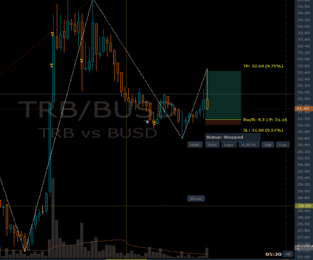
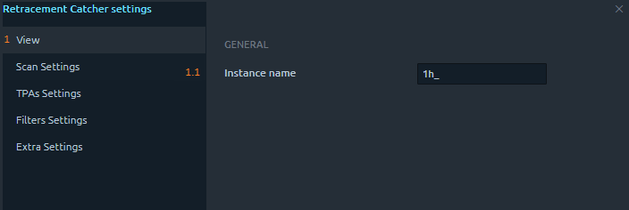
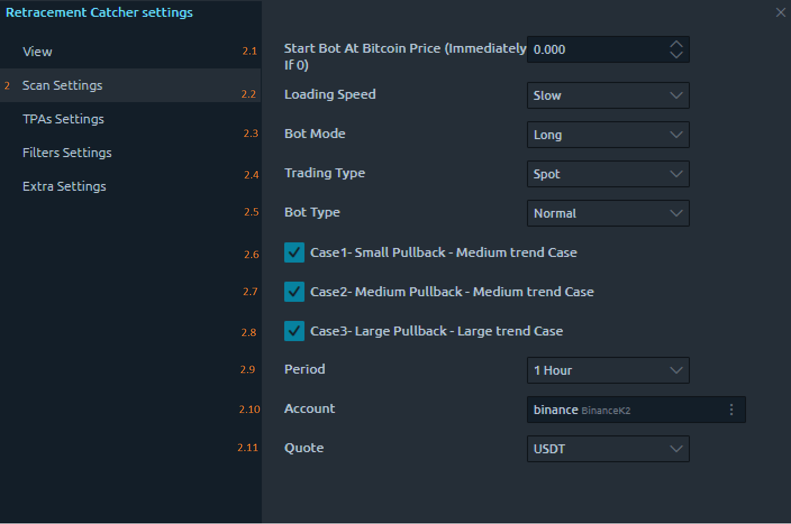
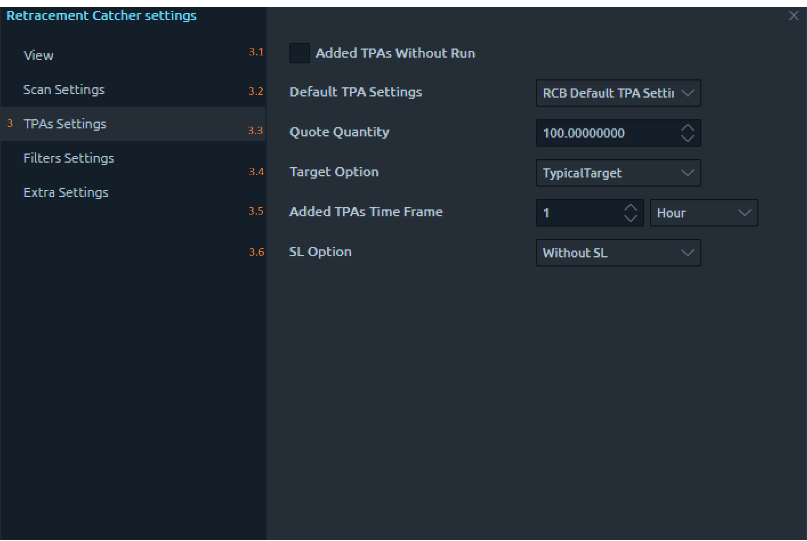
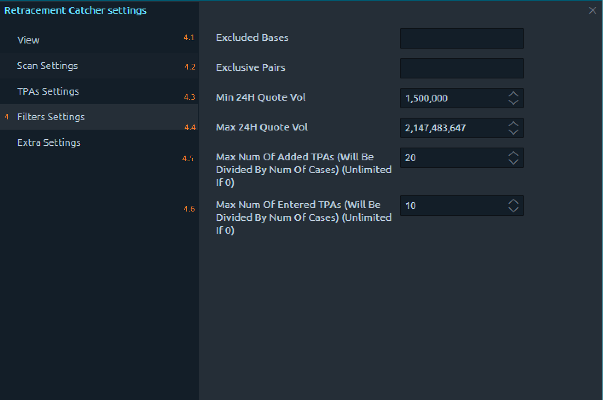
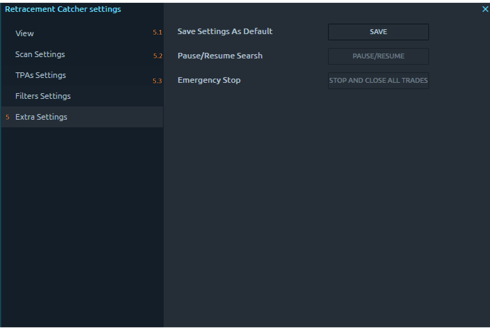
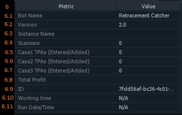

# Retracement Catcher Bot

## Introduction to Retracement Catcher Bot Documentation:

The Retracement Catcher Bot (RCB) introduces a streamlined approach to trading in the dynamic cryptocurrency market, making precision trading accessible through automated processes. This bot is designed to excel in identifying retracement opportunities, simplifying complex trading decisions without requiring manual intervention for configuring key settings.

RCB focuses on recognizing moments in the market where retracements are likely to occur, particularly during bullish upswings and bearish trends. Instead of relying on manual adjustments, RCB dynamically deploys a secondary bot known as the Trade Personal Assistant (TPA). This assistant manages crucial aspects such as trade entry, take profit, stop loss, risk management, money management, and exit conditions. By taking this comprehensive approach, RCB ensures users can confidently execute their trading strategies with ease.

In the following sections of this documentation, we will explore the specific features, parameters, and settings that empower users to customize the Retracement Catcher Bot according to their preferences. From customizable parameters to insightful metrics tracking performance, RCB provides a user-friendly platform for traders, whether they are seasoned experts or newcomers to the cryptocurrency trading landscape. Welcome to the Retracement Catcher Bot documentation—an essential guide to unlocking the potential of automated precision trading in the crypto world.

<figure><figcaption></figcaption></figure>

## Retracement Catcher Bot Settings:

To add the Retracement Catcher Bot to your trading strategy, follow these steps:

<figure><figcaption></figcaption></figure>

1\_Click on the 3rd Dimension Symbol: Navigate to the upper-left side of the trading platform and locate the 3rd Dimension symbol. Click on it to access additional features and functionalities.

2\_Choose the Symbol "STM" to Open the Strategies Manager: Within the 3rd Dimension features, select the symbol labeled "STM." This action opens the Strategies Manager, where you can manage and configure various trading bots and strategies.

3\_Click on the "+" Symbol to Visualize All Available Bots/Strategies: Once in the Strategies Manager, look for the "+" symbol and click on it. This action reveals a list of all available trading bots and strategies that can be integrated into your trading setup.

4\_From Strategies, Choose "Retracement Catcher": In the list of available strategies, locate and click on "Retracement Catcher." This selection adds the Retracement Catcher Bot to your trading setup, enabling you to access and customize its settings.

## RCB settings:

<figure><figcaption></figcaption></figure>

## 1: View

<figure><figcaption></figcaption></figure>

### 1.1 Instance Name

This section allows users to assign a unique name to their current instance of the Retracement Catcher Bot. The instance name is a user-defined label that helps differentiate various bot configurations, especially for users managing multiple instances simultaneously and will be the first part of the creator name in the TPAs added by this instance of the bot.

## 2: Scan Settings

<figure><figcaption></figcaption></figure>

### 2.1 Start Bot At Bitcoin Price

This field provides users with the flexibility to choose when the bot should start scanning the market. If a specific Bitcoin price is set, the bot will initiate its scanning strategy only when the market reaches the specified price. Leaving it empty or setting it to 0 triggers an immediate start.

### 2.2 Loading Speed

The loading speed determines how quickly the bot scans and adds trades. Users can select from three options: low, medium, and fast. This choice influences the speed at which the bot responds to market changes.


This option should be used carefully based on exchange requests rate to avoid getting too many requests error


### 2.3 Bot Mode

Users specify the bot's mode as either "Long" or "Short," indicating whether the bot should search for opportunities in a bullish or bearish market.

### 2.4 Trading Type

This setting allows users to define whether the bot should open trades in the spot or futures market, providing flexibility based on the user's preferred trading environment.

## 2.5 Bot Type

Users choose from three bot types - Scalping, Normal, and Extended. Scalping is designed for short retracements on a short timeframe, Normal for medium retracements, and Extended for large retracements on a longer timeframe.

### 2.6-2.7-2.8 Checkbox Cases

Users can choose from three checkboxes (Case1, Case2, Case3) to further confirm trade entry based on the size of the retracement trend. These checkboxes work in tandem with the selected Bot Type.

### 2.9 Period

Users can select the timeframe period (30 Min, 1 Hour, 4 Hour, 1 Day, 1 Week) during which the bot will apply its strategy for identifying potential trades.

### 2.10 Account

This drop-down menu lists all connected accounts on the platform, enabling users to choose the account through which the bot will execute trades.

### 2.11 Quote

Users can select their preferred quote currency from a drop-down menu (BTC, USDT, TUSD, BUSD, BNB, ETH) for trading pairs.

## 3: TPAs Settings

<figure><figcaption></figcaption></figure>

### 3.1 Added TPAs Without Run

When checked, this option allows the bot to open Trade Personal Assistants (TPAs) without immediately executing them. This feature provides users with additional control over the timing of their trades.

### 3.2 Default TPA Settings

Users can choose from predefined TPA settings or select from five additional custom settings (Setting0, Setting1, Setting2, Setting3, Setting4) to tailor TPAs to their trading preferences.

### 3.3 Quote Quantity

This numeric field enables users to specify the quantity when entering each trade, helping to control the size of their positions.

### 3.4 Target Option

Users can choose between "Typical Target" and "Closest Probable Target" to determine the price level at which the TPAs will set their Take Profit orders.

### 3.5 Added TPAs Time Frame

This setting allows users to specify the time frame on which the TPA settings will be applied, providing further customization for trade management.

### 3.6 SL Option

Users can select from three options - "Without SL" (no Stop Loss set), "Fixed Percentage" (set a fixed percentage SL for all TPAs), and "SL/TP Ratio" (set a SL price according to a ratio), providing flexibility in risk management.

## 4: Filters Settings

<figure><figcaption></figcaption></figure>

### 4.1 Excluded Bases

Users can input bases or a list of bases that they do not want the bot to scan, offering a level of customization to tailor the bot's scanning preferences.

### 4.2 Exclusive Pairs

Users can input pairs or a list of pairs that they want the bot to exclusively scan, allowing for targeted market analysis.

### 4.3 Min 24H Quote Vol

This numerical field lets users filter pairs based on the minimum 24-hour quote volume, ensuring that the bot focuses on actively traded assets.

### 4.4 Max 24H Quote Vol

This numerical field lets users filter pairs based on the maximum 24-hour quote volume, helping to avoid overly volatile or illiquid assets.

### 4.5 Max Num Of Added TPAs

Users can specify the maximum number of TPAs that the bot will find with the specified strategy, allowing for control over the quantity of potential trades.

### 4.6 Max Num Of Entered TPAs

Users can specify the maximum number of TPAs that the bot will allow to enter at the same time with the specified strategy, providing control over the number of active trades.

## 5: Extra Settings

<figure><figcaption></figcaption></figure>

### 5.1 Save Settings As Default

This option allows users to save the current settings as the default configuration for future instances, streamlining the setup process.

### 5.2 Pause/Resume Search

Users can use this option to temporarily halt or resume the search for trading opportunities, providing flexibility in managing the bot's activity.

### 5.3 Emergency Stop

This button, when pressed, close all TPAs (stop and close its deals) that were opened using the current strategy. It serves as an emergency measure to quickly exit trades in certain situations.

## 6\_Metrics

<figure><figcaption></figcaption></figure>

### 6.1 Bot Name

Displays the name of the bot, representing the strategy applied by the Retracement Catcher Bot. Users can easily identify the specific strategy or approach employed.

### 6.2 Version

Indicates the current version of the Retracement Catcher Bot. Users can check for updates and ensure they are using the latest features and improvements.

### 6.3 Instance Name

Reflects the name assigned to the current instance of the Retracement Catcher Bot. Users can distinguish between different instances if managing multiple bots concurrently.

### 6.4 Scanners

Provides the count of instances the bot has scanned the market. This metric gives insights into the bot's activity and how frequently it has assessed potential trading opportunities.

### 6.5 Case1 TPAs (Entered/Added)

Displays two numbers (e.g., 4/8). The first number (4) represents how many Trade Personal Assistants (TPAs) related to Case 1 have been entered. The second number (8) represents the total number of TPAs found for Case 1.

### 6.6 Case2 TPAs (Entered/Added)

Similar to Case1 TPAs, this metric provides the count of entered and found TPAs specific to Case 2.

### 6.7 Case3 TPAs (Entered/Added)

Similar to Case1 and Case2 TPAs, this metric details the number of entered and found TPAs related to Case 3.

### 6.8 Total Profit

This metric calculates the percentage of profit generated by the strategy from all the closed Trade Personal Assistants (TPAs). It represents the cumulative profit/lose achieved by considering the individual profits/loses of each closed TPA.

### 6.9 ID

Displays the unique identification number assigned to the Retracement Catcher Bot. This ID helps in tracking and managing multiple instances of the bot.

#### 6.10 Working Time

Indicates the duration for which the bot/strategy has been actively working. It calculates the time elapsed from the initiation of the strategy until it is stopped.

#### 6.11 Run Date/Time

Displays the date and time when the bot/strategy was started. This timestamp provides users with information on when the current strategy session commenced.

