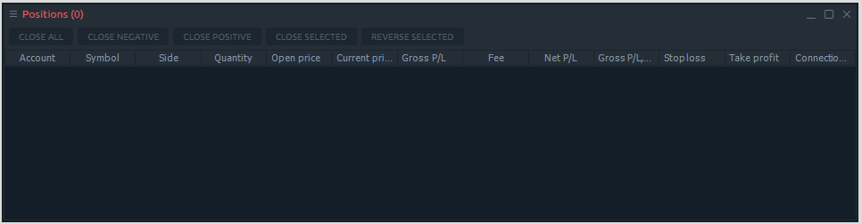

# Market Replay

[**First launch of the Market Replay**](market-replay.md#first-launch-of-the-market-replay)\
[**General and instruments settings**](market-replay.md#general-and-instruments-settings)

### What is Market Replay

Testing of trading strategies is one of the most important and necessary steps for successful trading. If you are an experienced algotrader, then the automatic testing method is ideal and you can use our Extension for Visual Studio. But unfortunately, many traders don't know the programming language, which makes testing their strategies difficult.

Therefore 3rd Dimension provides the **Market Replay panel** for simple manual backtesting of any trading strategy.

<figure><figcaption>
Testing process with Market Replay panel
</figcaption></figure>

Market Replay allows you to test on any trading instruments with any vendor or broker. This is especially useful when you have access to the data feed that does not allow execution of orders (quotation date feeds like crypto exchange).

### First launch of the Market Replay

* Start the panel from the main application menu
* Add a trading instrument for testing
* Set the data type  — Tick, 1 minute, 1 day
* Set the execution type  — Last or Bid/Ask/Last
* Click on the "Start" button to start testing

<figure><figcaption>
Launch Market Replay panel
</figcaption></figure>

<figure><figcaption>
General view of Market Replay with main settings
</figcaption></figure>


If you click on the "**Stop"** button, all test progress will be canceled.


When the testing is started you can open all the necessary panels for testing by clicking on the “Open panel” button.

<figure><figcaption>
Open necessary panels to create a workspace for backtesting
</figcaption></figure>

### General and instruments settings

Before you start testing the strategy, you need to set up an initial trading balance, a simulation (or modeling) scheme for downloaded data, a commission size for a trading instrument, and the netting type.

<figure><figcaption>
Set up the initial trading balance and modeling scheme
</figcaption></figure>

Strategy testing can be performed by one of three schemes to choose from:

* **OHLC** - in this mode the sequence is constructed only by the OHLC prices of the minute bars, the number of the generated control points is significantly reduced - hence, so is the testing time.
* **Open** - in this mode, all trades are opened at the opening price of the next bar. This mode is well suited for testing strategies, which process deals only at the opening of the bar and do not use pending orders, as well as StopLoss and TakeProfit orders.
* **Close** - in this mode, all trades are opened at the closing price of the current bar.


"Open" and “Close” modes have the fastest testing time, but they are not suitable for all of the trading strategies. Select the desired test mode based on the characteristics of the trading system.


Now let's look at the main settings of the selected trading instrument

<figure><figcaption>
Basic settings for trading instrument — Netting type and Additional Fees
</figcaption></figure>

In the **Netting type** section, you can choose the method by which to summarize existing and new positions:

* **One position** - it is possible to open one position for one instrument in one direction in this mode. If you previously opened a position to buy 1 lot, adding a position to sell 1 lot will close the previous position. New trades for buy will be summed by volume, and the entry price will be averaged.

<figure><figcaption>
Positions are overlapped by the netting type called "One Position"
</figcaption></figure>

**Multiple per Side** - this mode allows you to open many different positions in one direction.  For example, opening several positions in the sequence, they will be opened separately. Opposite trades (for sale) will close them.

<figure><figcaption>
Positions are overlapped by the netting type called "Multiple Per Side"
</figcaption></figure>

**Multiple Positions** - each new trade will be opened as a separate item, including the opposite trades.

<figure><figcaption>
Positions are overlapped by the netting type called "Multiple Position"
</figcaption></figure>
