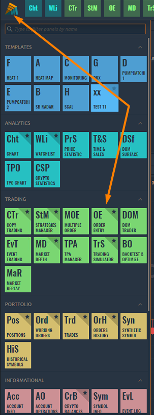
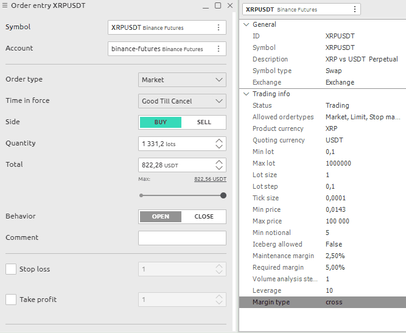

# Order Entry

[**Order Entry for Bybit connection**](broken-reference)

### How to open the Order Entry panel?

Open the main menu by clicking the logo and in the **Trading section** click on the OE icon.

<figure><figcaption>
Open Order Entry panle in general menu
</figcaption></figure>

### General info

**Order Entry** panel allows to create trading orders with different conditions, such as order quantity, price, side, order type, and submit them on the market. From the Order Entry panel, you can supply all of the necessary information for order and easily submit it by clicking the appropriate action button.

<figure><figcaption></figcaption></figure>

The entire panel is conventionally divided into several zones:

* choice of trading instrument and trading account;
* setting the required order quantity and the order side (Buy or Sell);
* choice of order type, its price and TIF condition;
* setting of stop loss and take profit prices;
* information on current Ask and Bid prices, spread size, VWAP prices, as well as an order placement button.

## Symbol and account selection 

The selection of a trading instrument can be performed manually through the [Symbol Lookup](../../general-settings/symbols-lookup.md) or via linking the panel to other panels, for example, to the chart. Just select one link color in two panels and they will have a synchronized symbol parameter.

If there are several trading accounts available within your connection, you can select the required account by clicking the **Select Account** button.

## **Order types and restrictions** 

Order Entry automatically lists all exchange-supported order types available for the associated instrument under the selected connection. Within our existed connections we support:

* **Market order** is an order placed without a price with the intention of hitting the best Bid or taking the best Offer currently available in the market. The order fills at the current best price.
* **Limit order** allows submitting an order at a specific limit price or better.
* **Stop order** allows submitting a buy or sell market order if and when the stop trigger price is touched.

**Time-in-force** (TIF) instructions define the length of time over which an order will continue working before it is canceled. Within our existed connections we support many TIFs:

* **DAY** is an order will be canceled if it is not executed within the current trading day;
* **FOK** (or Fill or Kill) - an order will be canceled if it is not executed in the entire volume as soon as it becomes available;
* **GTC** (Good till canceled) orders will remain working until they are canceled by trader or the contract expires;
* **IOC** (Immediate or cancel) requires that any portion of an order that is not filled as soon as it becomes available in the market is canceled;
* **GTD** (Good till date) order will remain working within the system and in the marketplace, until it executes or until the close of the market on the date specified.


The TIF list can be different depends on connection, order type or instrument type!


## Order Protection 

To protect the position from a significant loss, you can use the **Stop Loss** orders. To do this, activate the "_**Stop Loss**_" checkbox and specify the price at which the order will be closed.

Once the position becomes profitable, you can change the Stop Loss price to a break-even level. To automate this process, **Trailing Stop** was created. This tool is especially useful when price changes strongly in the same direction or when it is impossible to watch the market continuously for some reason.

To gain profit, you can use the **Take Profit** order, which will automatically close the position at the specified price. To do this, activate the "_**Take Profit**_" checkbox and specify the price at which the order will be closed.


Stop Loss order can be set:

* for Long positions below the current price
* for Short positions above the current price

Take Profit order can be set:

* for Long positions above the current price
* for Short positions below the current price


**Order Confirmation**

Once you have set all the necessary parameters of the order and clicked the **PLACE ORDER** button, the order confirmation screen will appear.

This window contains summary information about your order, which will allow you to verify the correctness of the entered data - order type, trade instrument, price, quantity, prices of take profit and stop loss.

If you activate the "_**Do not show again**_" checkbox, the confirmation will not be displayed and the order will be immediately sent to the order book. In order to return these notifications, it is necessary to activate the "_**Confirm order placement**_" checkbox in the [General settings](broken-reference) of the application
